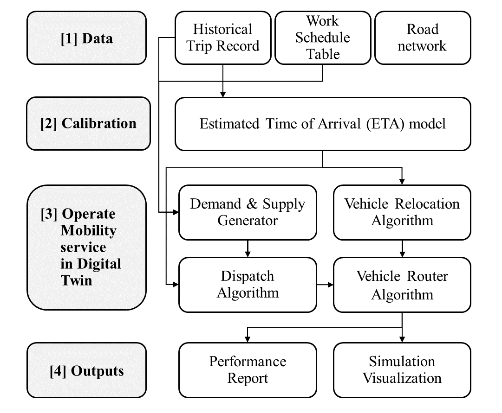

<!-- 덱 설계
청중: 가천대 스마트시티학과 학부 3학년, 첫 시간. Python 기초만 가정
시간: 45~50분 (남는 시간에 1주차 화요일분 시작) → 본문 18장
메시지: 한 학기 동안 도시 모빌리티 시뮬레이터 한 대를 밑바닥부터 만든다
목표: (1) 무엇을 만들고 무엇을 직접 짜는지 (2) 12주 흐름과 평가·기말 무당이 프로젝트 (3) 오늘 해야 할 일
출처: syllabus.md, schedule.md, PLANNING.md (2026-08-31 무당이 팀 프로젝트 확정안) · 제외: 각 주차 세부 내용(해당 주차 슬라이드)
-->

# 이 과목

## 이 과목에서 만드는 것

- 한 학기 동안 도시 모빌리티 시뮬레이터 한 대를 밑바닥부터 만듭니다.
- 도로망을 읽어 최단경로를 구하고, 대중교통 시간표로 환승 경로를 찾고, 통행 수요를 만들어 차량에 배차하고, 그 결과를 지표와 그림으로 냅니다.
- 마지막에는 가천대 교내셔틀 무당이를 시뮬레이션하고 개선안을 분석합니다.
- 데이터 분석·최적화·머신러닝을 따로 배우지 않습니다. 시뮬레이터를 만드는 데 필요해진 지점에서 하나씩 다룹니다.

> 과목 이름은 스마트 교통물류지만, 개론 수업이 아닙니다. 결과물이 하나 있는 수업입니다. 학기가 끝나면 여러분 손에 시뮬레이터 한 대가 남습니다. 이론을 먼저 다 배우고 나중에 적용하는 순서가 아니라, 만들다가 막히는 지점에서 그때 필요한 이론을 꺼내는 순서로 갑니다.

## 시뮬레이터의 네 부분



> 이 그림이 학기 전체의 지도입니다. 도로망(2~4주차), 경로 탐색(3·5·6주차), 수요(7주차), 배차와 루프(10~11주차). 매주 이 그림의 한 조각을 채웁니다.

## 학습 목표

이 과목을 마치면 다음을 할 수 있습니다.

- OpenStreetMap 도로망과 GTFS 대중교통 시간표를 읽어 분석에 쓸 수 있는 형태로 만듭니다.
- 최단경로(다익스트라, A*)와 대중교통 경로 탐색(RAPTOR)을 직접 구현하고, 실제 엔진과 대조해 검증합니다.
- 통행 수요를 생성하고 배차 알고리즘을 비교하며, 이산시간 시뮬레이션 루프를 직접 짭니다.
- 실제 지역의 개선 시나리오를 설계하고, 그 효과를 서비스율·대기시간 같은 숫자로 제시합니다.

## 직접 짜는 것과 가져다 쓰는 것

- 세 가지는 라이브러리 없이 직접 짭니다. 최단경로(3주차, 약 90줄), RAPTOR(5주차, 약 150줄), 시뮬레이션 루프(11주차, 약 150줄)입니다.
  - 셋 다 짧고, 짜 보지 않으면 안에서 무슨 일이 일어나는지 알 수 없음
- 나머지는 완성된 코드를 읽고 인자를 바꿔 가며 실험합니다. 수요 생성기와 배차 알고리즘이 여기에 속합니다.
- 무거운 계산은 DTUMOS 엔진에 HTTP로 맡깁니다. 엔진 내부는 Rust지만, 이 과목에서 Rust를 다루지는 않습니다.

> 전부 직접 짜면 12주 안에 시뮬레이터가 완성되지 않습니다. 짧고 핵심적인 세 개만 직접 짜고, 나머지는 읽고 실험합니다. 직접 짠 코드는 항상 기준과 대조합니다 — 다익스트라는 NetworkX와, RAPTOR는 실제 엔진과.

# 12주 흐름

## 12주 흐름 — 1~6주차

표: 1~6주차 — 데이터에서 대중교통 경로 탐색까지
| 주차 | 날짜 | 교재 | 주제 | 만드는 것 |
|---|---|---|---|---|
| 1 | 09-01·02 | 0·1장 | 환경 준비와 시뮬레이션 개요 | 첫 시뮬레이션 실행 |
| 2 | 09-08·09 | 2장 | 도로망 데이터 | OSM → 인접 리스트 |
| 3 | 09-15·16 | 3장 | 밑바닥부터 최단경로 | 다익스트라·A* 직접 구현 |
| 4 | 09-22·23 | 4·5장 | 시간대별 속도 · GTFS | 혼잡 반영 경로, GTFS 필터 |
| 5 | 09-29·30 | 6장 | 밑바닥부터 RAPTOR | RAPTOR 직접 구현 |
| 6 | 10-06·07 | 7장 | 환승·요금과 대중교통 지표 | 통합환승요금, 엔진 대조 |

> 3주차와 5주차가 직접 구현 첫 두 개입니다. 6주차에 기말 프로젝트를 시작합니다.

## 12주 흐름 — 7~12주차

표: 7~12주차 — 수요·배차에서 기말 발표까지
| 주차 | 날짜 | 교재 | 주제 | 만드는 것 |
|---|---|---|---|---|
| 7 | 10-13·14 | 8·12장 | 통행 수요와 결과 읽기 | 수요 생성, 지표·시각화 |
| 8 | 10-20·21 | — | 휴강 (강릉세계총회) | HW3 — 무당이 GTFS·조사 |
| 9 | 10-27·28 | — | 중간시험과 해설 | 프로젝트 중간 점검 |
| 10 | 11-03·04 | 9·10장 | 통행시간 예측과 배차 최적화 | ETA 모델, 할당 문제 |
| 11 | 11-10·11 | 11장 | 이산시간 시뮬레이션 루프 | 루프 직접 구현 |
| 12 | 11-17 | — | 기말 프로젝트 발표 · 종강 | 팀 제출·발표 |

> 8주차는 강릉세계총회 참석으로 휴강하고 온라인 과제(HW3)로 대체합니다. 그래서 중간시험이 학사일정보다 1주 늦은 10-27입니다. 11주차에 직접 구현 마지막 조각인 시뮬레이션 루프를 짜면 시뮬레이터가 완성됩니다.

## 수업 방식

- 화요일에 개념과 코드를 함께 보고, 수요일에 직접 짜고 돌립니다. 노트북을 매 시간 가져옵니다.
- LLM을 수업 중에도 씁니다. ChatGPT, Claude, Gemini 등의 구독을 권장합니다.
  - 나온 코드를 이해하고, 막힌 곳을 짚어 고칠 수 있어야 함 (중간 코딩테스트에서도 사용 가능)
- "돌아간다"와 "맞다"는 다릅니다. 직접 짠 코드는 항상 기준과 대조합니다.
  - 이 습관이 이 과목에서 가장 오래 남는 것

> LLM 금지가 아니라 권장입니다. 다만 LLM이 짠 코드를 설명하지 못하면 시험에서 그대로 드러납니다. 대조 습관 — 무엇과 비교했고 어디가 달랐는지 — 이 과목이 기르려는 핵심 태도입니다.

# 평가

## 평가 비중

표: 평가 항목과 비중
| 항목 | 비중 | 비고 |
|---|---|---|
| 중간시험 | 30% | 10-27(화) · 교재 0~8장, 12장 |
| 기말 팀 프로젝트 | 40% | 무당이 시뮬레이션과 개선 분석 |
| 과제 및 참여도 | 20% | HW1~HW3 |
| 출결 | 10% | 결석 1점(1회 유예) · 지각 0.5점(2회 유예) |

> 출결은 결석 1회, 지각 2회까지는 차감하지 않습니다. 기말이 40%로 가장 큽니다 — 다음 장에서 설명합니다.

## 중간시험

- 10-27(화)에 봅니다. 범위는 교재 0~8장과 12장입니다.
- 단답형(closed-book, 40%)과 코딩테스트(open-book, 60%)로 구성됩니다.
  - 코딩테스트는 사이버캠퍼스로 출제, ipynb와 데이터 제공, LLM 사용 가능
- 외운 것을 묻지 않습니다. 주어진 데이터에서 답을 뽑아내는 과정을 봅니다.

> 학사일정상 중간고사 기간은 10-20~26이지만 8주차 휴강으로 1주 순연했습니다. 코딩테스트에서 LLM을 열어 두는 이유: 실무에서도 열려 있기 때문입니다. 대신 문제가 "LLM에 그대로 넣으면 풀리는" 형태가 아닙니다.

## 기말 팀 프로젝트 — 무당이

- 가천대 교내셔틀 무당이를 시뮬레이션하고, 개선 시나리오의 효과를 숫자로 제시합니다.
  - 4~5명 팀, 최대 6팀 · 6주차 시작, 12주차 발표
- 무당이는 GTFS도 승하차 기록도 없습니다. 시간표를 GTFS로 직접 옮기고, 승하차를 직접 조사합니다.
- 팀이 현황을 재현하고, 팀원 각자가 개선 시나리오 하나씩을 맡습니다.
  - 배차간격 · 노선 변경 · 차량 대수 · DRT 대체 · 시간대별 운행 중 택 1 (팀 내 중복 불가)

> 매일 타는 셔틀이 대상입니다. 데이터가 없다는 것이 이 프로젝트의 핵심 경험입니다 — 시간표를 GTFS로 옮기고 승하차를 세어 보면, 세상 모든 교통 데이터가 누군가 이렇게 만든 것임을 알게 됩니다. 조사는 8주차 휴강 주에 캠퍼스에서 합니다.

## 프로젝트 일정과 배점

- 평가 100점
  - 팀 55: 데이터 20 · 정확도 20 · 발표 15
  - 개인 45: 설계 20 · 해석 25
- 동료평가 ±10% 조정

표: 기말 프로젝트 산출물 일정
| 시점 | 산출물 | 단위 |
|---|---|---|
| 6주차 | 팀 구성 · 시나리오 배정 | 팀 |
| 8주차 | 무당이 GTFS · 승하차 조사 (HW3) | 팀 |
| 9주차 | 수요 프로파일 · 현황 재현 | 팀 |
| 11주차 | O-D 100건 실제 엔진과 대조 | 팀 |
| 12주차 | 시나리오 before-after · 발표 | 개인+팀 |

> 개인 45점은 자기가 맡은 시나리오의 설계와 지표 해석입니다. 팀에 묻어가는 구조가 아닙니다. 산출물이 수업 진도와 맞물려 있어, 수업만 따라오면 프로젝트가 저절로 쌓입니다.

## 과제

- HW1 (3주차): 교재 2장 연습문제 — 하남시 도로망 통계와 스냅.
- HW2 (6주차): 직접 짠 RAPTOR를 레퍼런스와 대조하고 차이를 설명.
- HW3 (9주차): 무당이 GTFS 작성·검증과 승하차 조사표 — 팀 제출, 8주차 휴강 대체.
- 과제는 모두 "돌아가는 코드"가 아니라 "기준과 대조한 결과"를 냅니다.

> 무엇과 비교했고 어디가 달랐는지를 쓰는 것이 과제의 본체입니다. 코드가 돌아가기만 하면 되는 과제는 없습니다.

# 실습 환경

## 환경 설치

- Python 3.11을 씁니다.
- 교재 저장소를 받고
  - 의존성을 설치하면 끝
- 버전이 전부 고정되어
  - 같은 그림이 나옴
- 확인은 import 한 줄

```bash
git clone \
  https://github.com/jihoyeo/mobility-simulation-book.git
cd mobility-simulation-book
pip install -r requirements.txt

python -c "from smartmob import Dtumos"
# (결과) 아무 출력 없이 끝나면 설치 성공
```

> requirements.txt가 버전을 전부 고정해 두었으므로, 같은 버전이면 교재와 같은 그림이 나옵니다. 수요일 수업 전까지 이 네 줄이 되는 상태로 와야 합니다. 막히면 단톡방에 올리세요.

## 엔진과 코랩

- 시뮬레이션 엔진은 강의용 공용 서버를 씁니다.
  - 서버 없이도 교재에 녹화된 실행 결과로 모든 코드가 돌아감 — 집에서 복습할 때 설치할 것 없음
- 엔진 내부를 직접 열어 보는 실습은 각자 노트북에서 Docker로 돌립니다. 사전 빌드 이미지를 배포합니다.
- 구글 코랩도 됩니다. 각 장의 Colab 배지를 누르고 첫 셀에서 `smartmob.colab.bootstrap()`을 실행합니다.

> 노트북 사양 걱정은 하지 않아도 됩니다. 무거운 계산은 서버가 하고, 서버가 죽어도 교재의 녹화 모드로 진도가 나갑니다.

## 교재와 참고 자료

- 주교재: *Urban Mobility Simulation* — jihoyeo.github.io/mobility-simulation-book
  - 학기 중 계속 고쳐지므로 웹으로 읽는 것이 항상 최신본, 코드는 같은 이름의 GitHub 저장소
- 부교재: 『핸즈온 머신러닝 3판』(10주차 ETA 예측 배경), Google OR-Tools 문서(10주차 배차·물류).
- 참고 논문(OSMnx, RAPTOR, 헝가리안 방법, 라이드셰어링, SUMO)은 해당 주차에 다시 안내합니다.

> 교재는 제가 이 수업을 위해 쓰고 있는 책이고, 여러분이 첫 독자입니다. 오탈자·이상한 설명을 찾아 주면 반영합니다. 책을 사지 않아도 됩니다.

# 운영과 오늘 할 일

## 운영 정보

표: 수업 운영 정보
| 항목 | 내용 |
|---|---|
| 강의 시간 | 화 13:00–14:50 · 수 15:00–16:50 (AI공학관 210호) |
| 오피스 아워 | 수 17:00–20:00 · gachon.webex.com/meet/jihoyeo |
| 담당 교수 | 여지호 · jihoyeo@gachon.ac.kr |
| 조교 | 개강 후 공지 |
| 소통 | 카카오톡 단톡방 · 이메일 |
| 학생 상담 | 학기 중 1인 1회 · 화·수 수업 직후 |

> 질문은 단톡방이 가장 빠릅니다. 상담은 전원 1회씩 진행하니, 상담이 불가능한 날짜와 시간을 오늘 시트에 적어 주세요.

## 종강 이후 — P-실무프로젝트

- 11-24(화)부터 12-10(목)까지 평일 10:00–12:00, 210호. 최종발표는 12-11(금)입니다.
- 자유주제입니다. 실제 지자체·광역교통을 대상으로 버스 노선 개선안을 시뮬레이션으로 평가합니다.
- 정규 수업과 기말에서 만든 파이프라인(GTFS 필터링 → RAPTOR → 지표)을 새 지역에 다시 돌립니다.
  - 전국 GTFS와 수도권 생활이동 O-D 사용 · 주제는 첫날 11-24에 확정

> 기말이 작은 폐쇄계(무당이)라면 P-실무프로젝트는 열린 실제 시스템입니다. 시내버스 노선 조정, 광역버스 평가, 저수요 노선 DRT 전환 같은 메뉴가 있고 자유주제는 승인제입니다. 상세는 p-practical-project 저장소에 있습니다.

## 오늘 할 일

- 카카오톡 단톡방에 들어옵니다.
- 상담일정 시트에 상담이 불가능한 날짜와 시간을 적습니다.
- 수요일 수업 전까지 Python 3.11과 교재 저장소를 설치합니다.
  - `from smartmob import Dtumos` 가 되면 끝
- 다음 시간(수 15:00, 210호): 하남시 도로망을 읽고 첫 시뮬레이션을 돌립니다. 노트북을 가져옵니다.

> 오리엔테이션 뒤 남는 시간에 1주차 화요일분 — 교재 1장 「왜 시뮬레이션인가」 — 을 시작합니다.
