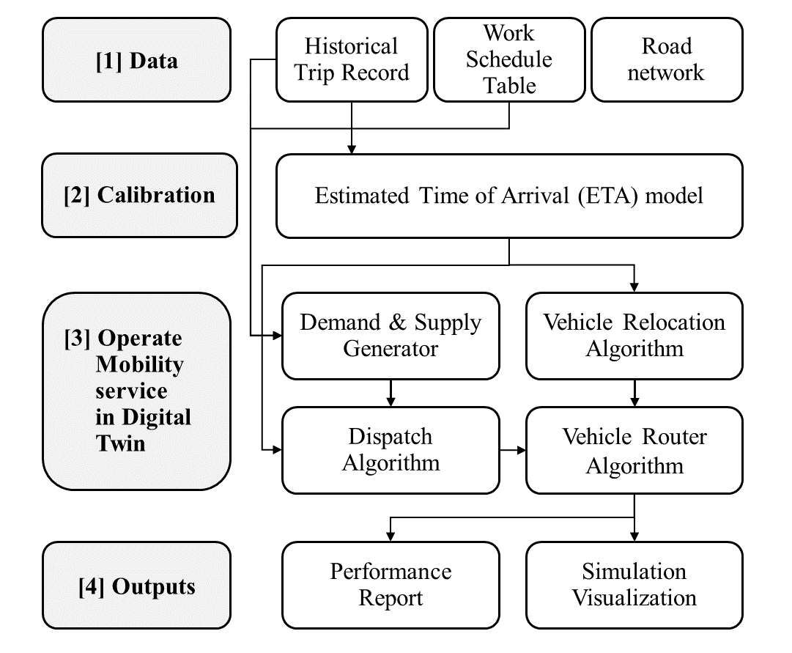

<!-- 덱 설계
청중: 가천대 스마트시티학과 학부 3학년, 첫 시간. Python 기초만 가정
시간: 45~50분 (남는 시간에 1주차 화요일분 시작) → 본문 18장
메시지: 한 학기 동안 도시 모빌리티 시뮬레이터를 단계별로 직접 만든다
목표: (1) 한 학기 결과물과 직접 구현할 부분 (2) 12주 일정과 평가·무당이 프로젝트 (3) 첫 수업 전 준비 사항
출처: syllabus.md, schedule.md, PLANNING.md (2026-08-31 무당이 팀 프로젝트 확정안) · 제외: 각 주차 세부 내용(해당 주차 슬라이드)
-->

# 수업 소개

## 한 학기 동안 만들 시뮬레이터

- 한 학기 결과물: 도시 모빌리티 시뮬레이터
  - 도로망 → 최단경로 → 환승 경로 → 수요 생성 → 배차 → 지표·시각화
- 기말 적용 대상: 가천대 교내셔틀 무당이의 개선안 분석
- 데이터 분석·최적화·머신러닝: 구현 과정에 필요한 시점마다 적용

> 스마트 교통물류 전반을 훑는 개론 수업은 아닙니다. 한 학기 동안 하나의 시뮬레이터를 단계별로 완성합니다. 이론을 모두 배운 뒤 적용하는 방식이 아니라, 구현 단계마다 필요한 이론을 배우고 바로 적용합니다.

## 시뮬레이터의 전체 구조



> 이 그림은 한 학기 동안 다룰 범위를 보여 줍니다. 2~4주차에는 도로망, 3·5·6주차에는 경로 탐색, 7주차에는 수요, 10~11주차에는 배차와 시뮬레이션 루프를 다룹니다.

## 학습 성과

- OpenStreetMap 도로망과 GTFS 시간표를 분석 가능한 형태로 정리
- 최단경로(다익스트라·A*)와 RAPTOR 직접 구현, 실제 엔진과 대조 검증
- 통행 수요 생성, 배차 알고리즘 비교, 이산시간 시뮬레이션 루프 작성
- 개선 시나리오 설계와 서비스율·대기시간 기반 효과 제시

## 직접 구현과 기존 도구 활용

- 직접 구현: 라이브러리 없이 알고리즘 3개 작성
  - 최단경로 3주차 약 90줄 · RAPTOR 5주차 약 150줄 · 루프 11주차 약 150줄
- 제공 코드 활용: 수요 생성기와 배차 알고리즘
  - 완성된 코드에서 인자만 변경
- 외부 엔진 활용: 계산량이 큰 작업은 DTUMOS에 HTTP 요청
  - 엔진 내부는 Rust, 이 과목의 범위 밖

> 모든 기능을 직접 구현하지는 않습니다. 학습 목표와 직접 관련된 알고리즘 세 개는 직접 작성하고, 나머지는 제공 코드나 외부 엔진을 활용합니다. 직접 구현한 결과는 기준 구현과 대조합니다. 다익스트라는 NetworkX, RAPTOR는 DTUMOS 결과와 비교합니다.

# 12주 수업 일정

## 1~4주차: 도로망과 경로 탐색

표: 1~4주차 — 도로망 데이터에서 시간대별 속도까지
| 주차 | 날짜 | 교재 | 주제 | 실습 결과 |
|---|---|---|---|---|
| 1 | 09-01·02 | 0·1장 | 환경 준비와 시뮬레이션 개요 | 첫 시뮬레이션 실행 |
| 2 | 09-08·09 | 2장 | 도로망 데이터 | OSM → 인접 리스트 |
| 3 | 09-15·16 | 3장 | 최단경로 직접 구현 | 다익스트라·A* 직접 구현 |
| 4 | 09-22·23 | 4·5장 | 시간대별 속도 · GTFS | 혼잡 반영 경로, GTFS 필터 |

> 3주차에는 첫 번째 직접 구현 과제인 최단경로 알고리즘을 다룹니다.

## 5~8주차: 대중교통과 통행 수요

표: 5~8주차 — 대중교통 경로 탐색에서 통행 수요까지
| 주차 | 날짜 | 교재 | 주제 | 실습 결과 |
|---|---|---|---|---|
| 5 | 09-29·30 | 6장 | RAPTOR 직접 구현 | RAPTOR 직접 구현 |
| 6 | 10-06·07 | 7장 | 환승·요금과 대중교통 지표 | 통합환승요금, 엔진 대조 |
| 7 | 10-13·14 | 8·12장 | 통행 수요와 결과 읽기 | 수요 생성, 지표·시각화 |
| 8 | 10-20·21 | — | 휴강 (강릉세계총회) | HW3 — 무당이 GTFS·조사 |

> 6주차에 기말 프로젝트를 시작합니다. 8주차는 강릉세계총회 참석으로 휴강하고 온라인 과제(HW3)로 대체합니다. 그래서 중간시험이 학사일정보다 1주 늦은 10-27입니다.

## 9~12주차: 시험과 기말 프로젝트

표: 9~12주차 — 중간시험에서 기말 발표까지
| 주차 | 날짜 | 교재 | 주제 | 실습 결과 |
|---|---|---|---|---|
| 9 | 10-27·28 | — | 중간시험과 해설 | 프로젝트 중간 점검 |
| 10 | 11-03·04 | 9·10장 | 통행시간 예측과 배차 최적화 | ETA 모델, 할당 문제 |
| 11 | 11-10·11 | 11장 | 이산시간 시뮬레이션 루프 | 루프 직접 구현 |
| 12 | 11-17 | — | 기말 프로젝트 발표 · 종강 | 팀 제출·발표 |

> 11주차에는 세 번째 직접 구현 과제인 시뮬레이션 루프를 작성합니다. 이 단계까지 마치면 한 학기 동안 만든 구성요소가 하나의 시뮬레이터로 연결됩니다.

## 수업 방식

- 화요일: 개념과 코드 설명 · 수요일: 직접 구현과 실행
  - 매 시간 노트북 지참
- 수업 중 LLM 사용 가능 — ChatGPT·Claude·Gemini 등
  - 조건: 생성된 코드를 설명하고 오류를 수정할 수 있는 수준
- 실행 성공과 결과 검증의 구분
  - 직접 구현한 결과는 기준 구현과 대조

> 수업과 코딩테스트에서 LLM을 사용할 수 있습니다. 다만 생성된 코드를 설명하고 수정할 수 있어야 합니다. 코드가 실행되는지만 확인하지 말고, 무엇과 비교했으며 결과가 어떻게 다른지도 기록해야 합니다.

# 평가

## 평가 비중

표: 평가 항목과 비중
| 항목 | 비중 | 비고 |
|---|---|---|
| 중간시험 | 30% | 10-27(화) · 교재 0~8장, 12장 |
| 기말 팀 프로젝트 | 40% | 무당이 시뮬레이션과 개선 분석 |
| 과제 및 참여도 | 20% | HW1~HW3 |
| 출결 | 10% | 결석 1점(1회 유예) · 지각 0.5점(2회 유예) |

> 출결은 결석 1회, 지각 2회까지는 차감하지 않습니다. 기말이 40%로 가장 큽니다 — 다음 장에서 설명합니다.

## 중간시험

- 일시·범위: 10-27(화) · 교재 0~8장과 12장
- 구성: 단답형 closed-book 40% · 코딩테스트 open-book 60%
  - 사이버캠퍼스에서 출제 · ipynb와 데이터 제공 · LLM 사용 가능
- 평가 내용: 주어진 데이터를 분석해 답을 도출하는 과정

> 학사일정상 중간고사 기간은 10월 20일부터 26일까지지만, 8주차 휴강으로 시험을 한 주 늦췄습니다. 코딩테스트에서는 실무 환경을 고려해 LLM 사용을 허용합니다. 단순히 문제를 입력해 답을 얻는 방식이 아니라, 제공된 데이터를 분석하고 결과를 검증하는 과정을 평가합니다.

## 기말 팀 프로젝트: 무당이

- 대상: 가천대 교내셔틀 무당이 — 개선 시나리오의 효과를 수치로 비교
  - 4~5명 팀, 최대 6팀 · 6주차 시작, 12주차 발표
- 시작 조건: GTFS와 승하차 기록 없음 → 시간표 작성과 현장 조사부터 진행
- 역할 분담: 팀 단위 현황 재현 · 개인별 개선 시나리오 1개
  - 배차간격 · 노선 변경 · 차량 대수 · DRT 대체 · 시간대별 운행 중 택 1 (팀 내 중복 불가)

> 학생들이 매일 이용하는 셔틀을 분석 대상으로 삼습니다. 기존 GTFS와 승하차 기록이 없기 때문에 시간표를 직접 옮기고 현장에서 승하차 인원을 조사합니다. 이 과정을 통해 교통 데이터가 만들어지는 절차도 함께 익힙니다. 현장 조사는 8주차 휴강 기간에 교내에서 진행합니다.

## 프로젝트 일정과 배점

표: 기말 프로젝트 산출물 일정
| 시점 | 산출물 | 단위 |
|---|---|---|
| 6주차 | 팀 구성 · 시나리오 배정 | 팀 |
| 8주차 | 무당이 GTFS · 승하차 조사 (HW3) | 팀 |
| 9주차 | 수요 프로파일 · 현황 재현 | 팀 |
| 11주차 | O-D 100건 실제 엔진과 대조 | 팀 |
| 12주차 | 시나리오 before-after · 발표 | 개인·팀 |

> 총점은 100점입니다. 팀 점수는 55점으로 데이터 20점, 정확도 20점, 발표 15점입니다. 개인 점수는 45점으로 시나리오 설계 20점과 지표 해석 25점입니다. 여기에 동료평가 결과를 반영해 ±10%를 조정합니다. 개인이 맡은 시나리오를 별도로 평가하므로 팀 점수만으로 개인 점수가 결정되지는 않습니다. 각 산출물은 수업 진도에 맞춰 단계별로 제출합니다.

## 과제와 공통 평가 기준

- HW1 (4주차) — 교재 2장 도로망 통계와 3장 다익스트라 구현
- HW2 (6주차) — 직접 짠 RAPTOR를 참조 결과와 대조하고 차이 설명
- HW3 (9주차) — 무당이 GTFS 작성·검증과 승하차 조사표 · 팀 제출, 8주차 휴강 대체
- 공통 평가 내용: 기준 결과와의 대조 및 차이 해석

> 모든 과제에서 코드 실행 여부뿐 아니라 비교 기준과 결과의 차이를 평가합니다. 무엇과 비교했는지, 차이가 있다면 원인이 무엇인지 결과에 함께 작성해야 합니다.

# 실습 환경

## 실습 환경 설치

- Python 3.11
- 저장소 복제 후 의존성 설치
  - requirements.txt가 버전 고정 → 교재와 같은 그림
- 설치 확인: import 한 줄

```bash
git clone \
  https://github.com/jihoyeo/mobility-simulation-book.git
cd mobility-simulation-book
pip install -r requirements.txt

python -c "from smartmob import Dtumos"
# (결과) 아무 출력 없이 끝나면 설치 성공
```

> requirements.txt에는 패키지 버전이 고정되어 있어 같은 환경에서 교재와 같은 결과를 재현할 수 있습니다. 수요일 수업 전까지 명령을 모두 실행하고 import가 오류 없이 끝나는지 확인해 주세요. 설치 중 문제가 생기면 단톡방에 오류 메시지를 올리면 됩니다.

## 실행 환경 선택

- 기본 환경: 강의용 공용 서버
  - 서버 연결 없이도 교재의 녹화 결과로 코드 실행 가능
- 엔진 내부 확인: 개인 노트북의 Docker와 사전 빌드 이미지 사용
- Google Colab: 각 장의 Colab 배지 → 첫 셀에서 smartmob.colab.bootstrap()

> 계산량이 큰 작업은 공용 서버에서 실행하므로 개인 노트북의 성능은 실습 진행에 큰 영향을 주지 않습니다. 서버에 연결할 수 없는 경우에는 교재에 저장된 실행 결과를 사용합니다.

## 교재와 참고 자료

- 주교재 — *Urban Mobility Simulation* · jihoyeo.github.io/mobility-simulation-book
  - 학기 중 계속 고쳐지므로 웹으로 읽는 것이 항상 최신본, 코드는 같은 이름의 GitHub 저장소
- 부교재 — 『핸즈온 머신러닝 3판』(10주차 ETA 배경), Google OR-Tools 문서(10주차 배차·물류)
- 참고 논문 — OSMnx, RAPTOR, 헝가리안 방법, 라이드셰어링, SUMO · 해당 주차에 재안내

> 주교재는 이 수업을 위해 작성 중인 공개 교재입니다. 학생들이 수업에서 처음 사용하게 됩니다. 오탈자나 이해하기 어려운 설명을 알려 주면 교재에 반영하겠습니다. 별도로 책을 구입할 필요는 없습니다.

# 수업 운영 안내

## 수업 시간과 소통 채널

표: 수업 운영 정보
| 항목 | 내용 |
|---|---|
| 강의 시간 | 화 13:00–14:50 · 수 15:00–16:50 (AI공학관 210호) |
| 오피스 아워 | 수 17:00–20:00 · gachon.webex.com/meet/jihoyeo |
| 담당 교수 | 여지호 · jihoyeo@gachon.ac.kr (조교는 개강 후 공지) |
| 소통 | 카카오톡 단톡방 · 이메일 |
| 학생 상담 | 학기 중 1인 1회 · 화·수 수업 직후 |

> 수업 관련 질문은 단톡방에서 가장 빠르게 확인할 수 있습니다. 학기 중 모든 학생과 한 차례씩 상담할 예정이니, 오늘 배포하는 시트에 상담이 어려운 날짜와 시간을 적어 주세요.

## 종강 이후 — P-실무프로젝트

- 일정: 11-24(화)~12-10(목) 평일 10:00–12:00, 210호 · 최종발표 12-11(금)
- 주제: 실제 지자체·광역교통의 버스 노선 개선안 평가
- 방법: 수업에서 만든 파이프라인(GTFS 필터링 → RAPTOR → 지표)을 새 지역에 적용
  - 전국 GTFS와 수도권 생활이동 O-D 사용 · 주제 확정은 첫날 11-24

> 기말 프로젝트는 무당이 한 노선을 분석하고, P-실무프로젝트는 실제 지자체의 노선망으로 범위를 넓힙니다. 시내버스 노선 조정, 광역버스 평가, 저수요 노선의 DRT 전환 등을 주제로 선택할 수 있습니다. 자유주제는 사전에 승인을 받아야 하며, 세부 내용은 p-practical-project 저장소에서 안내합니다.

## 오늘 할 일

- 카카오톡 단톡방 참여
- 상담 일정 시트에 상담이 어려운 날짜·시간 기입
- 수요일 수업 전까지 Python 3.11과 교재 저장소 설치
  - 확인: from smartmob import Dtumos 가 오류 없이 통과
- 다음 수업: 수요일 15:00, 210호
  - 하남시 도로망 읽기와 첫 시뮬레이션 · 노트북 지참

> 오리엔테이션을 마친 뒤 시간이 남으면 1주차 화요일 수업인 교재 1장 「왜 시뮬레이션인가」를 시작합니다.
