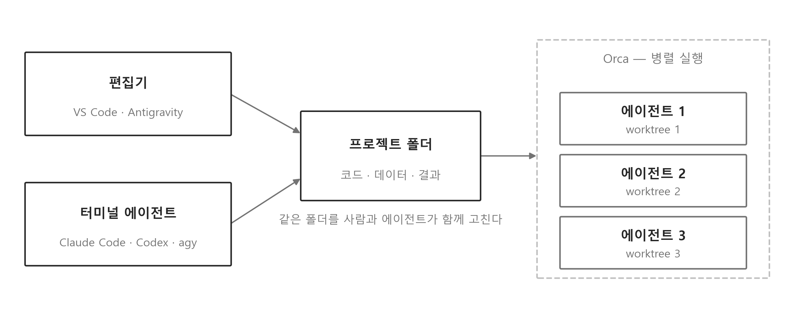

<!-- 덱 설계
청중: 스마트시티학과 2~3학년. 파이썬 숙련도 혼재, 터미널과 에이전트는 대부분 처음
시간: 60~75분 독립 세션 → 본문 26장. 설치는 슬라이드를 화면에 표시한 상태로 각자 진행
메시지: 도구를 깔고, 권한을 어디까지 열지 정하고, 남은 것은 확인과 기록이다
목표: (1) VS Code와 파이썬 설치·확인 (2) 에이전트 3종 설치와 로그인 (3) 권한 모드를 알고 조건을 정해 열기 (4) 명령어와 md 기록으로 토큰과 맥락 관리
출처: 각 도구 공식 문서(2026-09 확인) · AI 모빌리티 2주차 덱의 AI 코드 확인 항목
공용: 스마트 교통물류와 AI 모빌리티 두 과목이 같은 파일을 쓴다. 과목 고유 정보(교재 장 번호, 과제 번호, 데이터 이름)는 넣지 않는다
빌드: ~/miniconda3/bin/python3 ~/.claude/skills/md2pptx/scripts/md2pptx.py slides/common/dev_env.md
-->

# 오늘 준비하는 것

## 오늘 만드는 작업 환경

- 설치 대상 4가지 — 편집기, 파이썬, 터미널 에이전트 2종
- 두 과목 공용 — 같은 환경으로 한 학기 진행
- 진행 방식: 슬라이드를 화면에 표시한 상태로 각자 노트북에서 설치
- 오늘의 종료 조건: 확인 항목 네 개가 각자 화면에서 통과

> 두 과목이 같은 환경을 쓴다. 설치가 막히는 사람은 손을 들게 하고, 끝난 사람이 옆자리를 돕게 한다. 오늘 안 끝나면 오피스 아워에서 이어 처리한다.

## 학습 목표

- VS Code와 파이썬 설치, 가상환경까지 확인
- 코딩 에이전트 3종 설치와 로그인
- 권한 모드 세 단계와 각 단계를 여는 조건
- 명령어와 기록 파일로 맥락과 토큰 관리

> 네 가지가 각자 노트북에서 확인되어야 다음 시간 실습이 나간다. 세 번째와 네 번째가 오늘의 무게 중심이다.

# 편집기와 파이썬

## VS Code 설치와 확장

- 내려받기: code.visualstudio.com — 운영체제 자동 인식
- Windows 설치 화면: PATH 추가 항목 체크
- 확장 3개
  - Python · Jupyter · Korean Language Pack
- 편집기 선택: VS Code 또는 Antigravity 중 하나를 주력으로

> Antigravity가 VS Code 기반이라 확장과 단축키가 거의 같다. 둘 다 깔아도 되고, 주력 하나를 정해 두면 수업 진행이 빠르다.

## 파이썬 3.11 설치

- 내려받기: python.org — 3.11 계열
- Windows 설치 첫 화면: PATH 추가 항목 체크 후 설치
- macOS: python.org 설치본 또는 Homebrew
- 확인: python --version → Python 3.11.x

> 3.11로 고정하는 이유는 두 과목의 실습 코드가 그 버전에서 검증되어 있어서다. 이미 3.12나 3.13이 깔린 사람도 3.11을 추가로 설치하면 된다. 윈도우에서 파이썬이 안 잡히면 대부분 PATH 항목을 놓친 경우다.

## 프로젝트 폴더와 가상환경

- 폴더 위치: 한글과 공백이 없는 경로 (예: C 드라이브 아래 dev 폴더)
- 가상환경 생성: python -m venv .venv
- 활성화
  - Windows: .venv\Scripts\Activate.ps1
  - macOS·Linux: source .venv/bin/activate
- 패키지 설치: pip install -r requirements.txt

> 가상환경은 과목마다 하나씩 만든다. 프롬프트 앞에 .venv 표시가 나오면 활성화된 것이다. 윈도우에서 실행 정책 오류가 나면 Set-ExecutionPolicy -Scope CurrentUser RemoteSigned를 한 번 실행한다.

## 설치 확인 3단계

- 파이썬 버전: python --version
- 패키지 목록: pip list — requirements의 이름이 보이는지
- VS Code 인터프리터: 명령 팔레트에서 Python: Select Interpreter → .venv 선택
- 확인 지점: 편집기 왼쪽 아래 인터프리터 표시가 .venv

> 여기까지가 파이썬 쪽 끝이다. 인터프리터를 .venv로 안 잡으면 터미널에서는 되는데 편집기에서만 임포트가 실패한다. 학기 내내 가장 자주 나오는 증상이다.

# 코딩 에이전트 세 가지

## 도구의 층위

- 편집기: 사람이 코드를 보고 고치는 곳
- 터미널 에이전트: 지시를 받아 파일을 직접 고치는 프로그램
- 공통점: 대상이 같은 프로젝트 폴더 하나

> 셋의 차이는 성능이 아니라 사람이 어디에 앉아 있는가다. 편집기는 사람이 중심이고, 터미널 에이전트는 지시와 확인이 중심이다. 오른쪽 Orca는 오늘 설치하지 않고 마지막에 소개만 한다.

## Claude Code 설치

- 설치 명령
  - Windows PowerShell: irm https://claude.ai/install.ps1 | iex
  - macOS·Linux: curl -fsSL https://claude.ai/install.sh | bash
- 확인: claude --version → 버전 번호 출력
- 첫 실행: 프로젝트 폴더에서 claude 입력 → 브라우저 로그인
- 계정 요건: Anthropic 유료 플랜 (무료 플랜 제외)

> 윈도우는 파워셸에서 실행한다. Git for Windows를 함께 깔면 에이전트가 배시를 쓸 수 있어 명령 호환 문제가 준다. 설치 후 터미널을 새로 열어야 claude 명령이 잡힌다.

## Codex 설치

- 사전 조건: Node.js 18 이상
- 설치 명령: npm install -g @openai/codex
- 첫 실행: codex 입력 → ChatGPT 계정 로그인
- 계정 요건: ChatGPT 유료 플랜 또는 OpenAI API 키

> 노드를 안 깔았으면 nodejs.org에서 LTS를 먼저 설치한다. 설치가 계속 막히면 웹 버전으로 진행해도 오늘 목표에는 지장이 없다.

## Antigravity 설치

- 내려받기: antigravity.google/download
- 요건: Windows 10 64비트 이상, macOS 12 이상(애플 실리콘), Linux
- 로그인: 구글 계정 · 인터넷 연결 필요
- 구조: VS Code 기반 — 확장과 단축키 대부분 동일

> 에디터 안에 에이전트가 들어 있는 형태라 터미널이 낯선 사람이 시작하기 쉽다. 인텔 맥은 지원 대상이 아니므로 그 경우 VS Code에 터미널 에이전트 조합으로 간다.

## 계정과 사용 한도

표: 도구별 계정 요건과 한도 소진 시 대비책
| 도구 | 계정 | 요금 | 대비책 |
|---|---|---|---|
| Claude Code | Anthropic | 유료 플랜 | 웹 Claude |
| Codex | ChatGPT 또는 API 키 | 유료 플랜 | 웹 Codex |
| Antigravity | 구글 | 무료 시작, 한도 있음 | Google Colab |

- 한도와 요금제는 학기 중에도 변경
- 과제 설계 전제: 특정 도구나 한도를 요구하지 않음
- 도구 하나가 막히면 다른 하나로 진행

> 세 개를 다 깔게 하는 이유는 한도가 서로 다른 시점에 소진되기 때문이다. 과제는 셋 중 무엇을 썼는지 묻지 않는다. 학생 계정 지원 여부는 단톡방에 공지한다.

# 권한 모드와 실행

## 에이전트를 여는 위치

- 실행 위치: 프로젝트 폴더에서 터미널 실행 → 그 폴더가 작업 범위
- VS Code: 터미널 메뉴에서 새 터미널 열기
- 첫 확인: 현재 경로와 파일 목록을 먼저 출력
- 위험 지점: 홈 폴더나 바탕화면에서 실행

> 폴더를 잘못 열고 지시하면 엉뚱한 파일이 바뀐다. 첫 줄에서 경로를 확인하는 습관을 오늘 들인다.

## 권한 모드 세 단계

표: 도구별 권한 단계와 설정 이름
| 도구 | 매번 승인 | 부분 자동 | 전면 자동 |
|---|---|---|---|
| Claude Code | 기본 모드 | acceptEdits | bypassPermissions |
| Codex | ask-for-approval | full-auto | yolo |
| Antigravity | Request Review | Proceed in Sandbox | Always Proceed |

- 전환: Claude Code는 Shift+Tab 순환, Codex는 /approvals, Antigravity는 설정 화면
- 시작 옵션: claude --dangerously-skip-permissions · codex --yolo
- 계획 먼저: Claude Code plan 모드 — 파일을 고치지 않고 계획만 제시

> Shift+Tab을 누르면 기본, acceptEdits, plan, bypassPermissions 순으로 돈다. 화면 아래 표시로 지금 어느 모드인지 항상 보인다. 수업에서는 plan 모드로 계획을 먼저 받고 실행으로 넘어가는 순서를 권한다.

## 권한을 여는 조건

- 조건 1: 깃 저장소이고 방금 커밋한 상태 — 되돌릴 수 있음
- 조건 2: 과제나 실습 폴더 — 개인 자료와 자격증명이 없는 곳
- 조건 3: 결과를 어떻게 확인할지 정해 둔 상태
- 금지: 홈 폴더, 연구실 공용 저장소, 자격증명이 있는 폴더

> 전면 자동은 확인을 없애는 기능이 아니라 확인 시점을 뒤로 미루는 기능이다. 되돌릴 수 없는 상태에서 열면 사고가 난다. 커밋하고 열고, 끝나면 git diff로 본다.

## 첫 지시 문장

- 지시 예시: 이 폴더의 requirements.txt로 가상환경을 만들고 설치, 실패 시 오류 원문과 원인 보고
- 오류 전달 방식: 화면 캡처가 아니라 터미널 출력 원문
- 한 번에 한 가지 — 설치와 분석을 한 지시에 섞지 않기
- 실행 전 확인: 무엇을 바꿀 것인지 먼저 말하게 하기

> 여기서 각자 한 번 시켜 본다. 설치가 이미 끝난 사람은 파이썬 버전과 설치된 패키지를 정리해 달라고 시킨다. 지시가 길 필요는 없고, 목적과 실패 시 행동을 적는 것으로 충분하다.

## 사람이 확인하는 것

- 행 수: 읽어들인 결과가 원본 파일과 일치
- 결측과 필터: 처리 방식과 조건이 의도한 범위와 일치
- 변경 범위: git status와 git diff로 실제로 바뀐 파일 확인
- 책임: 제출물의 정확성은 제출한 학생

> 도구 사용 여부는 묻지 않는다. 설명할 수 있는지만 확인한다. 확인 없이 넘어간 코드가 오차의 출처다.

# 명령어와 토큰

## 자주 쓰는 명령

표: 목적별 명령 대응
| 목적 | Claude Code | Codex |
|---|---|---|
| 모델·추론 강도 변경 | /model | /model |
| 대화 비우기 | /clear | /new |
| 대화 압축 | /compact | /compact |
| 규칙 파일 생성 | /init → CLAUDE.md | /init → AGENTS.md |

- 사용량 확인: Claude Code는 /context와 /usage, Codex는 /status
- 되돌리기: Claude Code는 /rewind, 공통으로 git diff와 git restore
- 이어서 작업: claude --continue 또는 claude --resume

> 명령 목록은 /help로 언제든 볼 수 있다. 오늘은 네 개만 외우게 한다. 모델 변경, 비우기, 압축, 규칙 파일이다.

## 대화를 비우는 기준

- 대화는 매 요청마다 통째로 다시 전송 — 길수록 느리고 비쌈
- 작업이 바뀌면 /clear — 과제 A에서 과제 B로 넘어갈 때
- 같은 작업이 길어지면 /compact — 요약만 남기고 이어 진행
- 확인 방법: /context로 무엇이 얼마나 차 있는지 확인

> 한 세션에서 세 시간 붙잡고 있으면 앞부분 대화가 계속 따라다닌다. 학생들이 한도를 가장 빨리 소진하는 경로가 이것이다.

## 모델 선택

- 작업 난이도에 따라 /model로 변경
- 가벼운 작업: 파일 정리, 형식 변환, 오류 메시지 해석
- 무거운 작업: 설계 결정, 알고리즘 구현, 원인이 불분명한 오류
- 판단 기준: 답이 틀렸을 때 알아챌 수 있는지 여부

> 항상 가장 큰 모델을 쓰는 것은 한도를 빨리 쓰는 방법일 뿐이다. 반대로 검증하기 어려운 작업에 작은 모델을 쓰면 확인 비용이 더 든다.

## md 파일로 남기는 맥락

- 대화는 사라지고 파일은 남음 — 결정과 절차는 md로 기록
- 프로젝트 규칙: CLAUDE.md 또는 AGENTS.md, /init으로 생성
- 작업 기록: notes 폴더에 주제별 md 한 장씩
- 다음 세션: 대화를 이어 가는 대신 그 파일만 읽히기

> 팀 프로젝트에서 특히 크다. 데이터 정의와 결정 근거를 md에 적어 두면 팀원과 에이전트가 같은 문서를 본다. 저장소 안에 있으니 깃 이력으로 언제 무엇이 바뀌었는지도 남는다.

## 토큰을 아끼는 습관

- 범위 좁히기: 폴더 전체 대신 파일과 함수 지정
- 계획 먼저: plan 모드로 합의한 뒤 실행 — 잘못 고친 뒤의 복구 비용이 가장 큼
- 반복 지시는 규칙 파일로 이동 — 매번 다시 설명하지 않기
- 작업 끝나면 결과를 md로 요약하고 /clear

> 네 가지를 지키면 같은 한도로 몇 배를 쓴다. 절약 자체가 목적이 아니라, 한 세션이 짧고 목적이 분명할수록 결과가 정확해진다.

# 병렬 실행과 정리

## Orca

- 형태: 오픈소스 데스크톱 앱 — 에이전트 CLI 여러 개를 한 화면에서 실행
- 격리 방식: 깃 worktree 하나에 에이전트 하나
- 지원 범위: Claude Code, Codex 등 CLI 30종 이상
- 오늘 설치 대상 아님 — 존재와 쓰임만 확인

> 브랜치마다 작업 폴더를 따로 두는 것이 worktree다. 에이전트마다 폴더가 다르니 같은 파일을 동시에 고쳐도 충돌하지 않는다. 관심 있는 사람은 깃허브 stablyai/orca에서 내려받는다.

## 병렬 실행이 필요한 시점

- 지금 단계: 에이전트 하나로 충분
- 필요해지는 시점: 팀 프로젝트에서 사람마다 다른 시나리오를 동시에
- 판단 기준: 기다리는 시간이 확인하는 시간보다 길어질 때
- 주의: 병렬로 늘려도 확인은 사람 몫

> 도구를 늘리는 것이 진도를 늘리지 않는다. 확인이 병목이면 병렬 실행은 대기 화면만 늘린다.

## 설치 확인 목록

표: 도구별 확인 방법과 정상 출력
| 도구 | 확인 방법 | 정상 출력 |
|---|---|---|
| 파이썬과 가상환경 | python --version · pip list | 3.11.x와 패키지 목록 |
| Claude Code | claude --version | 버전 번호 |
| Codex | codex --version | 버전 번호 |
| Antigravity | 앱 실행 | 구글 계정 로그인 상태 |

- 네 항목이 통과하면 오늘 목표 달성
- 하나라도 막히면 오류 원문을 단톡방에 올리기

> 여기서 손을 들게 해 확인한다. 통과하지 못한 사람의 오류 메시지를 모아 오피스 아워에 처리한다.

## 오늘의 정리

- 환경: VS Code · 파이썬 3.11 · 가상환경 · 에이전트 3종
- 권한: 되돌릴 수 있는 폴더에서만 자동 실행을 연다
- 관리: /clear와 /compact로 대화, md 파일로 결정과 절차
- 확인은 사람 몫 — 행 수, 결측과 필터, 변경 범위

> 학습 목표 네 가지를 다시 확인하고 마친다.

## 다음 시간

- 두 과목 모두 다음 시간부터 각자 노트북에서 코드 실행
- 준비물: 오늘 만든 가상환경, 로그인된 에이전트 1개 이상
- 막힌 항목: 오피스 아워 수요일 17시부터 20시까지
- 설치 관련 질문은 단톡방 — 오류 원문 포함

> 과목별 첫 실습 내용은 각 과목 덱에서 이어 안내한다.
