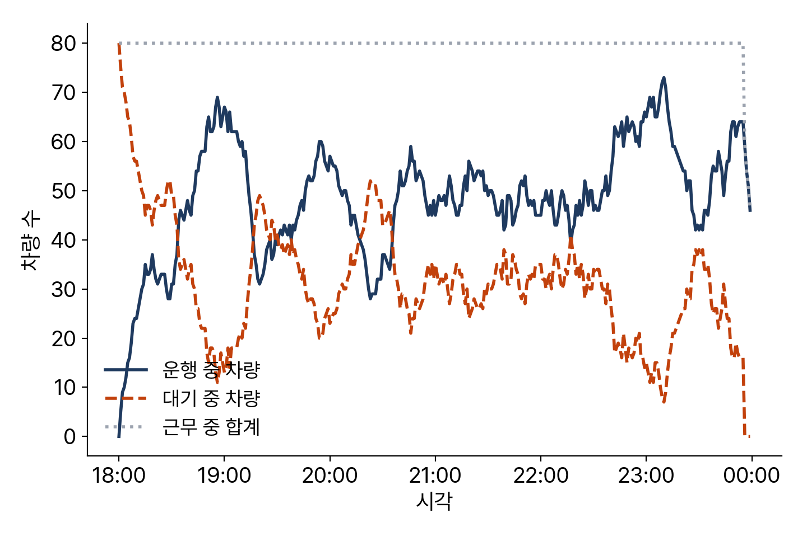

<!-- 덱 설계
청중: 가천대 스마트시티학과 학부 3학년. 화요일에 1장을 들은 상태, 설치는 아직
시간: 100분 중 슬라이드 20분, 나머지 80분은 교재 0장을 함께 띄우고 각자 설치·실행 → 본문 11장
메시지: 서버가 없어도 교재의 모든 코드가 돌아간다
목표: (1) 환경 설치와 smartmob 확인 (2) 하남시 도로망 크기 확인 (3) 엔진 연결과 녹화본 (4) 첫 시뮬레이션 결과 읽기
출처: mobility-simulation-book/ko/ch00_setup.md · 제외: 코드 타이핑(교재에서 직접), 부록 B 서버 구성
구조: 섹션 = 교재 절. 0.1과 0.2는 목차 6행 한도에 맞춰 한 섹션으로 통합했다
빌드: ~/miniconda3/bin/python3 ~/.claude/skills/md2pptx/scripts/md2pptx.py slides/week01/ch00_setup.md
-->

# 도입과 학습 목표

## 오늘 준비하는 세 가지

- 교재의 모든 코드는 실행되는 상태 — 같은 숫자, 같은 그림
- 필요한 것 3가지
  - 파이썬 환경
  - 실습 데이터
  - 시뮬레이션 엔진
- 마지막 순서: 하남시 택시 시뮬레이션 1회 실행

> 슬라이드는 중간중간 몇 장만 사용하고, 설치부터는 각자 노트북에 교재 0장을 표시한 상태로 함께 진행한다.

## 학습 목표

- 실습 환경 설치와 smartmob 임포트 확인
- 하남시 도로망의 노드·엣지 수 확인
- 엔진 연결, 연결 실패 시의 동작 확인
- 시뮬레이션 1회 실행 후 서비스율·평균 대기시간 읽기

> 교재 0장 학습 목표와 같다. 오늘 끝에 네 가지가 각자 노트북에서 확인되어야 다음 주 진도가 나간다.

## 교재와 실습을 여는 곳

표: 오늘 여는 파일과 경로
| 자료 | 경로 |
|---|---|
| 교재 원고 | ko/ch00_setup.md |
| 실습 노트북 | labs/ch00_setup.ipynb |

- 저장소: github.com/jihoyeo/mobility-simulation-book — blob/main 아래 경로
- 노트북 실행: jupyter lab labs/ch00_setup.ipynb
- 진행 순서: 슬라이드 개요 → 교재 본문 → 실습 노트북

> 슬라이드는 개요만 다룬다. 세부 내용과 코드는 교재 원고와 실습 노트북에서 확인한다. 교재 저장소는 비공개이므로 초대받은 계정으로 로그인한 상태여야 주소가 열린다.

# 교재 0.1–0.2 설치와 데이터

## 파이썬 환경과 의존성

- 파이썬 3.11 · 저장소 복제 후 pip install -r requirements.txt
  - 버전 고정 — 같은 버전이면 교재와 같은 그림
- 9장 예측 모델은 requirements-heavy.txt 추가
  - 그 주에 설치해도 무방
- 코랩: 각 장 상단 Colab 배지 → 첫 셀에서 smartmob.colab.bootstrap()

> 설치 명령은 교재 0.1에 그대로 있다. 화면에 표시한 상태로 한 줄씩 함께 입력한다. 막히는 사람은 손을 들게 하고, 끝난 사람이 옆자리를 돕게 한다.

## 실습 도시 하남시

- 선정 이유: 서울 인접 + 노트북에서 다룰 만한 크기
- 저장소에 포함된 데이터
  - 도로망 노드·엣지 (parquet)
  - 통행 수요 (demand.csv)
- load_road_graph("hanam", modes=("drive",)) → 노드 12,566 · 엣지 28,589
- 노드 기준: 교차로와 막다른 길만 — 사이 직선 구간은 엣지 하나

> 하남시 전체치고 노드가 적어 보이는 이유를 여기서 한 번 설명한다. modes 인자가 왜 필요한지는 2장에서 다루므로 오늘은 넘어간다.

# 교재 0.3 엔진 연결

## DTUMOS에 붙는 세 가지 방법

표: DTUMOS 엔진에 연결하는 세 가지 방법과 설정
| 방법 | 쓰는 상황 | 설정 |
|---|---|---|
| 공용 서버 | 수업 중 무거운 실행 | SMARTMOB_DTUMOS_URL |
| 로컬 Docker | 엔진 코드를 직접 확인할 때 | docker compose up -d |
| 녹화본 | 서버 없이 복습 | SMARTMOB_OFFLINE=1 |

- 엔진 DTUMOS: Rust · Docker · HTTP 호출
- 이 과목의 범위: 엔진 내부가 아니라 호출 방법
- 세 번째가 중요 — 서버 없이도 교재가 멈추지 않음

> 공용 서버 주소와 팀별 포트는 단톡방에 올린다. 저장소의 data/fixtures/에 실제 실행 결과가 녹화되어 있고, 연결이 안 되면 그것을 대신 반환한다.

## 녹화본의 범위

- dt.health()의 status
  - fixture — 녹화본 사용 중
  - 그 외 — 실서버 응답
- 녹화 범위: 교재에 나오는 요청만
- 차량 80대 → 81대로 변경 시 FixtureMissing
- 오류의 뜻: 코드 오류가 아니라 실서버 필요

> 이 구분을 지금 분명히 해 둬야 나중에 학생들이 FixtureMissing을 코드 버그로 오해하지 않는다.

# 교재 0.4 첫 시뮬레이션

## 하남시 저녁 6시부터 자정까지

표: 첫 시뮬레이션의 실행 조건
| 인자 | 값 |
|---|---|
| 도시 · 수단 | 하남 · 택시 |
| 차량 대수 | 80대 |
| 호출 건수 | 1,000건 |
| 시간 범위 | 1080 ~ 1440 (18:00~24:00) |

- 시간 단위: 자정부터의 분 — 책 전체 공통
- random_seed=42 고정 → 같은 결과 재현

> 인자 이름과 값을 한 번 읽고 넘어간다. 시간을 분 단위 정수로 다루는 규칙은 11장 시뮬레이션 루프까지 그대로 간다.

## 결과 세 숫자

표: sim.summary()가 반환하는 세 지표
| 지표 | 값 | 뜻 |
|---|---|---|
| service_rate | 1.0 | 호출 990건 전부 배차 |
| avg_waiting_time_min | 약 4.1분 | 호출부터 승차까지 평균 |
| utilization | 약 0.27 | 승객 탑승 시간 비율 |

- 승객 관점: 대기 4분 — 양호
- 차량 관점: 4분의 3이 유휴
- 이어지는 질문: 40대로 감축 시 대기시간 변화

> 세 번째 숫자가 다음 질문을 만든다. 이 질문에 답하려면 같은 수요와 같은 도로망에서 차량 대수만 변경해 다시 실행해야 하고, 그 도구를 이 책에서 만든다.

# 교재 0.5 시간에 따른 기록

## 분 단위 기록 읽기

- sim.record: 1분당 한 행
- 운행 중 증가분 = 대기 중 감소분
- 두 값의 합이 대부분 80

> plot_record(sim.record)로 그린다. 그림을 먼저 보여주고 마지막 30분에서 무엇이 이상한지 학생이 먼저 찾게 한다.

## 80대가 항상 80대는 아님

- 마지막 30분: 합계가 80 미만 · 대기 승객 증가
- 원인: 차량별 work_start · work_end
- 자정 근접 → 근무 중 차량 감소
- 결과 해석의 전제: 정원과 근무 인원의 구분

> 시뮬레이션이 차량 80대를 항상 80대로 다루지 않는다는 뜻이다. 이런 것을 미리 알고 있어야 결과를 잘못 읽지 않는다.

# 정리와 연습

## 오늘의 정리

- smartmob을 통해 데이터와 엔진에 접근
  - load_road_graph 도로망 · Dtumos 엔진
- 엔진 연결 실패 시 녹화본으로 자동 전환 — 복습에 설치 불필요
- sim.summary() 요약 지표 · sim.record 분 단위 시계열

> 학습 목표 네 가지가 각자 노트북에서 확인됐는지 손을 들게 해서 점검한다.

## 연습과 다음 장

- 연습 0.1 ★ — 대기 승객 최대 시각과 그때 인원
  - smartmob.data.minutes_to_hhmm으로 분을 HH:MM으로 변환
  - 산출물: 시각 1개, 인원 1개
- 다음 장: 2장 도로망 데이터 — 소요시간 계산의 입력 자료

> 확인 질문: 서비스율 1.0인데 왜 차량을 줄이자는 이야기가 나오는가. 가동률 0.27과 연결해서 답하게 한다.
