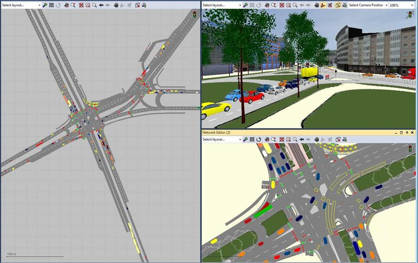
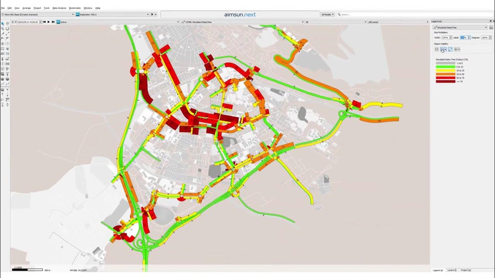
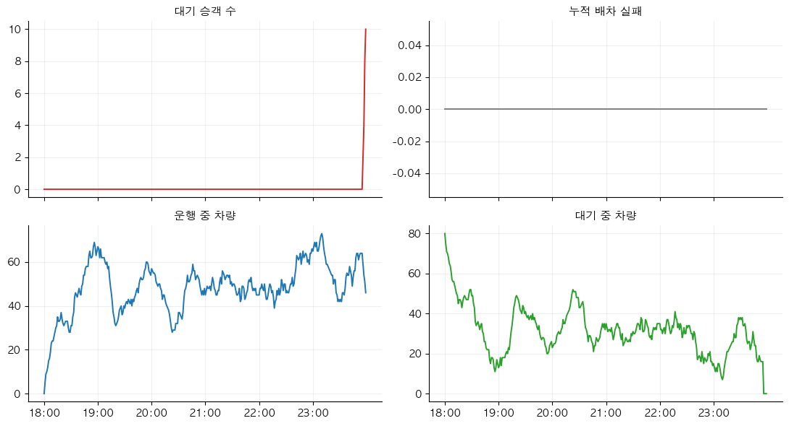

## 슬라이드 0 - 표지
제목: 1주차 — 왜 시뮬레이션인가, 환경 준비와 첫 시뮬레이션
부제: 스마트 교통물류 · 교재 1장, 0장
발표자: 여지호
소속: 가천대학교 스마트시티학과
발표날짜: 2026-09-01 (화) · 09-02 (수)
꼬리말: 스마트 교통물류 2026-2 · 1주차
section_slides: false

---
<!--
출처: mobility-simulation-book/ko/ch01_why.md, ko/ch00_setup.md, 서머리.md (0장·1장).
화요일 = 1장 개념 (약 21장), 수요일 = 0장 실습 (약 11장). 수치는 교재 값 그대로.
빌드: python3 ~/etc/slide-master/.claude/skills/academic-deck/scripts/md_to_pptx.py slides/week01.md --render
-->

## 화요일 — 왜 시뮬레이션인가 (교재 1장)

### 오늘의 질문

- 하남시가 심야에 수요응답형 버스를 20대 넣으려 합니다. 정해야 할 것이 세 가지입니다.
    - 차량을 어느 차고지에 몇 대씩 둘 것인가
    - 호출이 여러 건 겹쳤을 때 누구부터 태울 것인가
    - 그래서 승객이 평균 몇 분을 기다리게 되는가
- 세 번째 질문에 답하지 못하면 앞의 두 개도 정할 수 없습니다.
- 오늘은 그 답을 어떻게 얻는지에 관한 시간입니다.

### 학습 목표

- 시뮬레이션이 실제 운영과 무엇이 다른지 한 문장으로 설명합니다.
- VISSIM·SUMO 같은 기존 도구가 이 문제에 맞지 않는 이유를 댑니다.
- 0장에서 돌린 결과에서 "차량을 줄여도 되는가"라는 질문을 끌어냅니다.
- 이 책이 만들 시뮬레이터의 네 부분을 각각 몇 장에서 다루는지 압니다.

### 1.1 좋은 모빌리티 시스템이란

- 모빌리티 시스템은 사람과 물건을 옮기는 장치 전부입니다. 지하철과 버스, 택시, 자전거와 전동킥보드, 배달 오토바이, 그리고 두 발까지 포함합니다.
- 무엇이 좋은 시스템인지는 누구에게 묻느냐에 따라 다릅니다.
    - **승객**은 빨리 오고 빨리 가기를 바랍니다. 대기시간과 통행시간이 짧아야 합니다.
    - **운영자**는 차를 놀리고 싶지 않습니다. 차량 한 대가 하루에 몇 명을 태웠는지가 중요합니다.
    - **도시**는 도로가 막히지 않고 배기가스가 적기를 바랍니다.

### 1.1 세 관점은 서로 부딪힙니다

- 차를 많이 넣으면 대기시간은 줄지만 빈 차가 늘고, 도로에는 차가 더 늘어납니다.
- "좋다"를 말하려면 무엇을 얼마나 좋게 했는지와, 대신 무엇을 얼마나 포기했는지를 함께 숫자로 내놓아야 합니다.
- 이 과목은 그 숫자를 만드는 방법을 다룹니다. 12장에서 지표를 정리할 때 이 세 관점이 다시 나옵니다.

| 관점 | 바라는 것 | 지표의 예 |
|---|---|---|
| 승객 | 빨리 오고 빨리 간다 | 대기시간, 통행시간 |
| 운영자 | 차를 놀리지 않는다 | 차량당 하루 승객 수, 가동률 |
| 도시 | 막히지 않고 배기가스가 적다 | 총 주행거리, 공차 거리 |

### 1.2 왜 시뮬레이션이 필요한가

- 가장 확실한 답은 실제로 20대를 한 달 굴려 보는 것입니다. 그런데 한 달을 굴려도 얻는 것은 시나리오 하나입니다.
- 다음 질문에는 여전히 답할 수 없습니다.
    - 10대였으면 어땠을까
    - 차고지를 두 곳으로 나눴으면
    - 가까운 차 대신 빨리 도착할 차를 보냈으면
- 대안끼리 비교하려면 같은 한 달을 조건만 바꿔 다시 살아야 합니다. 도시에는 그런 되감기 버튼이 없습니다.

### 1.2 시뮬레이션은 되감기 버튼을 만드는 일입니다

- 도로망 위에 차량과 승객을 올려놓고 시간을 1분씩 밀면서, 몇 시 몇 분에 어떤 차가 어느 지점에 있었고 누구를 태웠는지를 전부 기록합니다.
- 차량 수를 10대로 바꿔 다시 돌리면, 같은 수요와 같은 도로망 위에서 두 조건의 평균 대기시간을 나란히 놓고 비교할 수 있습니다.
- 실제 운영과의 차이는 이것 하나입니다. 같은 하루를 조건만 바꿔 여러 번 살 수 있습니다.

### 1.2 이미 있는 도구를 쓰면 되지 않는가

- 교통 시뮬레이터는 이미 여럿 있습니다. 쓰지 않는 이유는 성능이 나빠서가 아니라, 각 도구가 답하도록 만들어진 질문이 우리 질문과 다르기 때문입니다.
- 화면 전체가 교차로 하나입니다. 차로 단위로 그리고, 차량마다 위치를 개별로 계산합니다.

**그림 1. VISSIM 화면 — 교차로 하나를 차로 단위로 그립니다**



### 1.2 미시 교통류 시뮬레이터가 계산하는 것

- VISSIM(독일 PTV)과 AIMSUN(스페인 TSS)은 미시 교통류 시뮬레이터입니다. 차량 한 대의 차간거리와 차로 변경을 초 단위로 계산합니다.
- 그래서 "이 교차로의 좌회전 신호를 5초 늘리면 대기행렬이 몇 미터 줄어드는가" 같은 질문에 강합니다.
- 대신 계산량이 그 정밀도를 따라 늘어납니다. 교차로 수십 개짜리 구역을 넘어 도시 하나의 하루를 통째로 돌리는 용도가 아닙니다.
- 둘 다 상용 라이선스가 필요합니다. 수강생이 각자 노트북에서 값을 바꿔 가며 반복 실험하기 어렵습니다.



### 1.2 SUMO는 가장 가깝지만

- SUMO(독일 DLR)는 같은 미시 시뮬레이터지만 오픈소스입니다. TraCI 인터페이스로 시뮬레이션이 도는 중에 파이썬에서 차량을 직접 제어할 수 있습니다.
- 우리가 하려는 일에 가장 가깝습니다. 다만 기본 단위는 여전히 '차로 위의 차량'입니다.
- 배차 규칙을 바꿔 가며 대기시간을 비교하려는 우리에게, 차로 변경 모형까지 계산하는 비용은 필요가 없습니다.

### 1.2 도구 비교

- 세 도구의 차이는 성능이 아니라 기본 단위와 답하는 질문입니다.

| 도구 | 기본 단위 | 공간 범위 | 라이선스 | 잘 답하는 질문 |
|---|---|---|---|---|
| VISSIM, AIMSUN | 차로 위의 차량 (초) | 교차로~구역 | 상용 | 신호 5초 늘리면 대기행렬은? |
| SUMO | 차로 위의 차량 (초) | 구역~도시 | 오픈소스 | 위와 같음 + 파이썬 제어 |
| 이 과목의 시뮬레이터 | 노드 위의 차량 (분) | 도시 전체 | 직접 작성 | 차를 40대로 줄이면 대기시간은? |

### 1.2 우리에게 필요한 조건

- 해상도: '차량이 차로 위 어디에 있는가'가 아니라 '차량이 몇 시 몇 분에 어느 노드에 있는가'면 충분합니다.
- 공간 범위: 교차로가 아니라 도시 전체여야 합니다.
- 반복: 수강생이 각자 값을 바꿔 가며 다시 돌릴 수 있어야 합니다.
- 직접 만든다고 하면 큰일처럼 들리지만, 재료는 이미 다 공개되어 있습니다.
    - 도로망은 OpenStreetMap에서 받습니다 (2장). 최단경로는 직접 짠 다익스트라로 구합니다 (3장). 대중교통 시간표는 공개 표준 GTFS를 씁니다 (5장).
- 우리가 새로 쓰는 것은 이 부품들을 시간 축 위에서 돌리는 수백 줄짜리 코드뿐입니다.

### 1.3 답이 나오면 다음 질문이 생깁니다

- 0장에서 하남시 저녁 시간대를 한 번 돌렸습니다. 그 결과를 다시 열어 봅니다.

```python
from smartmob import Dtumos

dt = Dtumos()
sim = dt.run_simulation(
    city="hanam", mode="taxi", fleet_size=80, num_passengers=1000,
    time_start=1080, time_end=1440, random_seed=42,
)
sim.summary()
```

- 호출 990건이 전부 배차됐고 평균 대기시간은 4.1분입니다. 여기까지는 좋은 결과처럼 보입니다.

### 1.3 평균만 보면 놓치는 것

```python
wait = sim.passengers["wait_min"]
for q in [0.5, 0.9, 0.95]:
    print(f"{q:>5.0%} 분위  {wait.quantile(q):5.1f}분")
print(f"최댓값     {wait.max():5.1f}분")
```

- 절반은 3분 안에 탔습니다 (중앙값 3.0분). 열에 하나는 8.3분 넘게, 스무 명 중 한 명은 11분 넘게 기다렸습니다.
- 가장 오래 기다린 사람은 41.6분입니다. 평균 4.1분이라는 숫자 하나로는 이 사람이 보이지 않습니다.

### 1.3 차량 쪽도 봅니다

```python
r = sim.result
print(f"승객 태운 차량 평균  {r['occupied_vehicle_num'].mean():.1f}대")
print(f"데리러 가는 차량 평균 {r['dispatched_vehicle_num'].mean():.1f}대")
print(f"빈 차 평균          {r['empty_vehicle_num'].mean():.1f}대")
```

- 승객을 태우고 있던 차는 평균 9.9대입니다. 31.3대는 그냥 서 있었습니다.
- 80대 중 승객을 태운 차는 열에 하나뿐입니다.

### 1.3 차량을 절반으로 줄이면?

- 40대로도 41분 기다린 사람이 더 늘지 않는다면, 나머지 40대는 다른 지역에 두는 편이 낫습니다.
- 이 질문에 답하려면 같은 저녁을 40대로 다시 살아야 합니다. 실제 운영에서는 불가능하고, 시뮬레이터에서는 인자 하나를 바꾸면 됩니다.
- 학기 내내 이 질문을 답할 수 있는 상태로 갑니다. 11장에서 직접 짠 루프로 답합니다.
- 교재 녹화본에는 80대짜리 결과만 들어 있습니다. 40대로 바꿔 돌리려면 DTUMOS 서버가 필요합니다 (부록 B).

### 1.4 시뮬레이터의 구조

- 우리가 만들 시뮬레이터는 네 부분으로 나뉩니다. 데이터를 넣어 모델을 보정하고, 그 위에서 서비스를 운영한 뒤, 결과를 지표와 그림으로 냅니다.


### 1.4 각 상자가 이 책의 장입니다

| 그림의 부분 | 하는 일 | 다루는 장 |
|---|---|---|
| Data | 도로망, 대중교통 시간표, 과거 통행 기록을 모읍니다 | 2장, 5장, 8장 |
| Calibration | 두 지점 사이가 실제로 몇 분 걸리는지 예측하는 모델을 만듭니다 | 3~4장, 9장 |
| Demand & Supply Generator | 언제 어디서 몇 명이 호출할지, 차량은 몇 대를 어디에 둘지 정합니다 | 8장 |
| Dispatch Algorithm | 호출이 겹쳤을 때 어느 차를 보낼지 정합니다 | 10~11장 |
| Vehicle Router | 정해진 차를 실제 도로 위로 움직입니다 | 3~4장 |
| Outputs | 지표를 계산하고 화면에 그립니다 | 12장 |

- 이 표를 학기 지도로 씁니다. 매주 어느 상자를 만들고 있는지 확인합니다.

### 1.4 가운데의 ETA 모델이 왜 필요한가

- 배차 알고리즘은 "어느 차가 가장 빨리 도착하는가"를 알아야 합니다. 그 값이 곧 ETA(도착 예정 시간)입니다.
- 직선거리로 어림하면 강을 건너야 하는 차를 가깝다고 잘못 고릅니다.
- 3장에서 도로망 위 최단경로로, 9장에서 실제 통행 기록으로 학습한 모델로 이 값을 구합니다.
- `Vehicle Relocation Algorithm`은 이 과목에서 다루지 않습니다. 빈 차를 수요가 많은 곳으로 미리 옮기는 문제인데, 배차와 수요 예측을 둘 다 알아야 손댈 수 있습니다.

### 정리

- 시뮬레이터는 같은 하루를 조건만 바꿔 여러 번 돌려 보는 장치입니다.
- VISSIM·SUMO는 차로 단위 해상도를 위해 만들어졌고, 우리가 필요한 것은 도시 단위 범위입니다.
- 평균만 보면 41분 기다린 승객이 보이지 않습니다. 분포를 함께 봐야 합니다.
- 하남시 80대 시나리오에서 승객을 태운 차는 평균 9.9대, 빈 차는 31.3대였습니다.
- 시뮬레이터 그림의 각 상자가 2장부터 12장까지에 하나씩 대응합니다.
- 2장에서는 첫 번째 상자인 도로망 데이터를 직접 열어 봅니다.

### 연습문제

- **연습 1.1 ★** — `sim.passengers`에서 10분 넘게 기다린 승객을 골라, 호출 시각 분포를 그려 봅니다. 특정 시간대에 몰려 있나요, 저녁 내내 흩어져 있나요?
    - 산출물: 히스토그램 1장, 그것을 읽은 문장 2~3줄
- **연습 1.2 ★★** — 승객·운영자·도시 관점에서 각각 하나씩, 하남시 심야 버스를 평가할 지표를 정합니다. 각 지표에 대해 (a) 어떤 데이터로 계산하는지, (b) 값이 커지면 좋은지 작아지면 좋은지, (c) 다른 두 지표와 어떻게 부딪히는지를 씁니다.
    - 산출물: 지표 3개, 각각 세 문장

### 수요일 준비물

1. Python 3.11을 설치합니다.
2. 교재 저장소를 받고 `pip install -r requirements.txt`를 실행합니다.
3. `from smartmob import Dtumos`가 오류 없이 되는지 확인합니다.

- 더 읽을거리: Lopez et al. (2018) *Microscopic Traffic Simulation using SUMO* — TraCI 부분만 읽어도 충분합니다. Horni, Nagel & Axhausen (2016) *MATSim* — 도시 전체를 에이전트 기반으로 돌리는 다른 접근입니다.

## 수요일 — 환경 준비와 첫 시뮬레이션 (교재 0장)

### 오늘 할 일

- 이 책의 코드는 전부 실행됩니다. 화면에 보이는 숫자와 그림은 여러분의 노트북에서도 똑같이 나와야 합니다.
- 그러려면 세 가지가 필요합니다. 파이썬 환경, 실습 데이터, 시뮬레이션 엔진입니다.
- 셋을 준비하고, 마지막에 하남시 택시 시뮬레이션을 한 번 돌립니다.
- 실습이 끝나면 `sim.summary()`의 서비스율·평균 대기시간·차량 가동률을 읽을 수 있습니다.

### 0.1 설치

- 파이썬 3.11을 씁니다. 저장소를 받고 의존성을 설치합니다.

```bash
git clone https://github.com/jihoyeo/mobility-simulation-book.git
cd mobility-simulation-book
pip install -r requirements.txt
```

- `requirements.txt`는 버전을 전부 고정해 두었습니다. 같은 버전을 쓰면 같은 그림이 나옵니다.
- 9장의 통행시간 예측 모델은 `scikit-learn`과 `LightGBM`이 더 필요합니다 (`requirements-heavy.txt`). 그 장에 가서 설치해도 됩니다.
- 구글 코랩에서는 각 장 위쪽의 Colab 배지를 누르고, 첫 셀에서 `smartmob.colab.bootstrap()`을 실행합니다.

### 0.2 데이터가 있는지 확인하기

- 실습 도시는 **하남시**입니다. 서울과 붙어 있으면서 노트북에서 다루기 좋은 크기라 골랐습니다.
- 도로망과 대중교통 시간표가 저장소에 이미 들어 있습니다.

```python
from smartmob.data import data_path

for name in ["road_graph_nodes.parquet", "road_graph_edges.parquet", "demand.csv"]:
    p = data_path(f"hanam/{name}")
    print(f"{name:28s} {p.stat().st_size / 1e6:6.2f} MB")
```

### 0.2 도로망 읽기

```python
from smartmob.data import load_road_graph

G = load_road_graph("hanam", modes=("drive",))
G
```

- 노드가 12,566개, 엣지가 28,589개입니다. 하남시 전체 도로망치고는 적어 보이지만, 교차로와 막다른 길만 노드로 잡고 그 사이 직선 구간은 엣지 하나로 묶은 결과입니다.
- `modes=("drive",)`는 자동차가 다닐 수 있는 도로만 남기라는 뜻입니다. 왜 이 인자가 필요한지는 2장에서 다룹니다.

### 0.3 엔진에 연결하기

- 최단경로나 시뮬레이션을 실제로 돌리는 것은 **DTUMOS**라는 별도 프로그램입니다. Rust로 짜여 있고 Docker 컨테이너로 돕니다. 이 과목에서는 그 안을 들여다보지 않고 HTTP로 부르기만 합니다.

| 방법 | 언제 쓰는가 | 설정 |
|---|---|---|
| 공용 서버 | 수업 중 무거운 시뮬레이션 | `SMARTMOB_DTUMOS_URL=http://<주소>:<팀별 포트>` |
| 로컬 Docker | 엔진 코드를 직접 열어 볼 때 | `docker compose up -d` 후 기본값 그대로 |
| 녹화본 | 서버 없이 복습할 때 | `SMARTMOB_OFFLINE=1` |

- 세 번째가 중요합니다. 서버에 못 붙어도 책이 멈추지 않습니다. 저장소에는 실제 실행 결과가 `data/fixtures/`에 녹화되어 있고, 연결이 안 되면 그것을 대신 돌려줍니다.

### 0.3 서버에 못 붙어도 책이 멈추지 않습니다

```python
from smartmob import Dtumos

dt = Dtumos()
dt.health()
```

- `status`가 `fixture`로 나오면 녹화본을 쓰는 중입니다. 실서버에 붙었다면 서버가 돌려준 상태가 그대로 나옵니다.
- 녹화본에는 이 책에 나오는 요청만 들어 있습니다. 차량 대수를 80대에서 81대로 바꾸면 `FixtureMissing` 오류가 납니다. 실서버가 필요하다는 뜻이지, 코드가 틀린 것이 아닙니다.

### 0.4 첫 시뮬레이션

- 하남시에서 저녁 6시부터 자정까지, 택시 80대로 1,000건의 호출을 처리합니다.
- `1080`은 자정부터의 분이고 18:00입니다. 이 책의 시간은 전부 이 단위입니다.

```python
sim = dt.run_simulation(
    city="hanam",
    mode="taxi",
    fleet_size=80,
    num_passengers=1000,
    time_start=1080,   # 18:00
    time_end=1440,     # 24:00
    random_seed=42,
)
sim.summary()
```

### 0.4 숫자를 하나씩 읽습니다

| 항목 | 값 | 뜻 |
|---|---|---|
| `service_rate` | 1.0 | 990건의 호출이 전부 배차됐습니다 |
| `avg_waiting_time_min` | 약 4.1분 | 호출하고 차가 올 때까지 평균 4분 걸렸습니다 |
| `utilization` | 약 0.27 | 차량이 승객을 태우고 있던 시간이 전체의 27%뿐입니다 |

- 마지막 값이 흥미롭습니다. 대기시간 4분이면 승객 입장에서는 괜찮은데, 차량의 4분의 3은 놀고 있었습니다.
- 80대가 너무 많은 것은 아닐까요? 40대로 줄이면 대기시간이 얼마나 늘어날까요? 같은 저녁을 조건만 바꿔 다시 살아야 답할 수 있습니다. 그게 이 책이 만드는 장치입니다.

### 0.5 시간에 따라 무슨 일이 있었는지 보기

- `sim.record`는 1분마다 한 줄씩 기록된 표입니다. `plot_record(sim.record)`로 그립니다.
- 운행 중 차량과 대기 중 차량은 거울처럼 움직입니다. 둘을 더하면 대부분의 시간에 80이 됩니다.
- 마지막 30분쯤에서 합이 80보다 작아지고, 대기 승객 수는 오히려 늘어납니다.

**그림 2. 하남시 18:00–24:00 시뮬레이션의 분 단위 기록**



### 0.5 "차량 80대"는 항상 80대가 아닙니다

```python
on_duty = sim.record["empty_vehicle_cnt"] + sim.record["driving_vehicle_cnt"]
print("근무 중 차량 최대:", on_duty.max())
print("근무 중 차량 최소:", on_duty.min())
print("마지막 시각 대기 승객:", sim.record["waiting_passenger_cnt"].iloc[-1])
```

- 근무 시간이 끝난 차량이 하나씩 빠집니다. 차량마다 `work_start`와 `work_end`가 정해져 있고, 자정이 가까워지면 남는 차가 줄어듭니다.
- 시뮬레이션이 "차량 80대"를 항상 80대로 다루지 않는다는 뜻입니다. 이런 것을 미리 알고 있어야 결과를 잘못 읽지 않습니다.

### 정리와 연습

- `pip install -r requirements.txt`로 환경을 만들고, `smartmob`을 통해 데이터와 엔진에 접근합니다.
- `load_road_graph("hanam")`이 도로망을, `Dtumos()`가 시뮬레이션 엔진을 담당합니다. 엔진에 못 붙으면 `data/fixtures/`의 녹화본으로 자동 전환됩니다.
- `sim.summary()`는 서비스율·평균 대기시간·차량 가동률을, `sim.record`는 분 단위 시계열을 줍니다.
- **연습 0.1 ★** — `sim.record`에서 대기 승객 수가 가장 많았던 시각과 그때의 인원을 구합니다. `smartmob.data.minutes_to_hhmm`으로 분을 `HH:MM`으로 바꿉니다. 산출물: 시각 1개, 인원 1개.
- 다음 주: 이 계산이 서 있는 바닥, 도로망 데이터를 직접 엽니다 (교재 2장).

> 확인 질문: 서비스율 1.0인데 왜 차량을 줄이자는 이야기가 나오는가. 가동률 0.27과 연결해서 답하게 합니다.
