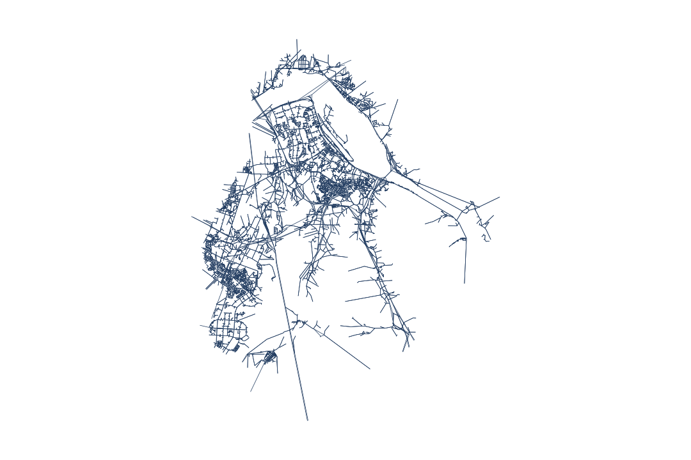
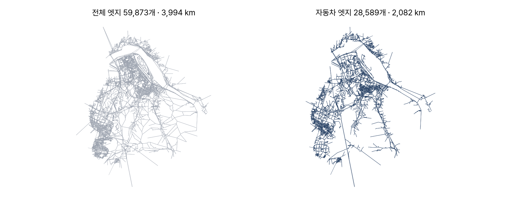
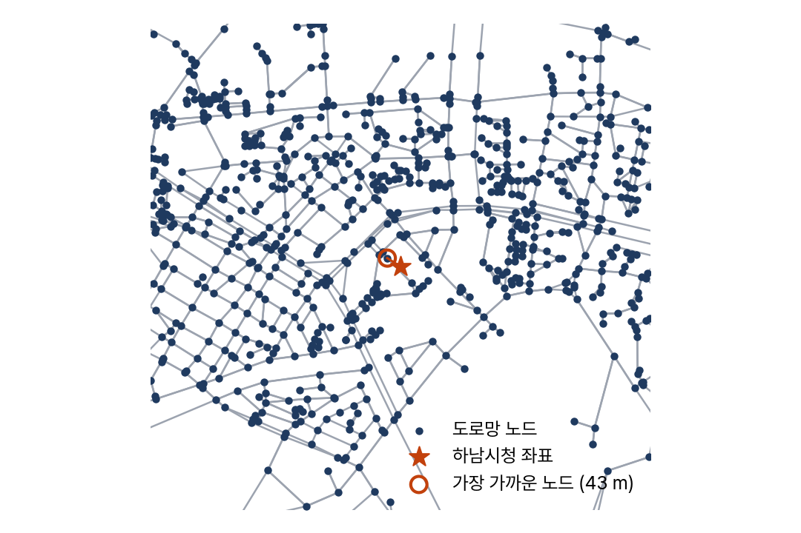

<!-- 덱 설계
청중: 가천대 스마트시티학과 학부 3학년. 1주차에서 환경 설치와 첫 실행을 마친 상태
시간: 화 100분(2.1~2.3) + 수 100분(2.4~2.6). 각 날 슬라이드 20분, 나머지는 교재 실행 → 본문 12장
메시지: 최단경로 계산의 입력 자료는 노드 표와 엣지 표 두 개다
목표: (1) 노드·엣지 표의 컬럼 (2) edge_id 파싱과 검증 (3) 통행수단 필터 (4) KD-트리 스냅
출처: mobility-simulation-book/ko/ch02_road_network.md · 제외: 코드 실행(교재에서), 연습 2.3 WKB 형상
구조: 섹션 = 교재 절. 2.4와 2.5, 2.6과 정리는 목차 6행 한도에 맞춰 한 섹션으로 통합했다
그림: figures/ch02_*.png 는 slides/tools/make_figures.py 로 생성
빌드: ~/miniconda3/bin/python3 ~/.claude/skills/md2pptx/scripts/md2pptx.py slides/week02/ch02_road_network.md
-->

# 도입과 학습 목표

## 소요시간 계산의 입력 자료

- 0장의 소요시간 계산에 쓰인 자료 = 도로망
- 도로망의 내용: 출발·도착 지점, 거리, 속도
- 이 장의 범위: 표를 직접 열고 함정 확인

> 0장에서 하남시청에서 미사역까지 몇 분 걸리는지 시뮬레이터가 알아서 계산했다. 그때 무슨 자료를 썼는지 오늘 확인한다. 3장에서 이 표를 최단경로용 자료구조로 바꾼다.

## 학습 목표

- 노드 표와 엣지 표의 컬럼 설명
- 엣지 id 파싱 → 인접 리스트 구성
- 통행수단별 엣지 필터와 미적용 시의 결과
- KD-트리를 쓴 좌표 스냅 구현

> 교재 2장 학습 목표와 같다. 화요일이 앞의 세 개, 수요일이 마지막 하나와 실습이다.

# 교재 2.1 도로망은 표 두 개

## 노드 표와 엣지 표

표: 도로망을 이루는 두 파일과 주요 컬럼
| 표 | 한 행의 뜻 | 주요 컬럼 |
|---|---|---|
| 노드 | 지점 하나 | node_id, lat, lon, node_type |
| 엣지 | 두 지점 사이 구간 | edge_id, highway, length, free_flow_speed_kmh |

- 하남시: 노드 12,566 · 엣지 28,589
- node_type 거의 전부 교차로
  - boundary는 시 경계 절단점
- 꺾이기만 하는 중간점은 노드 아님
- length ÷ speed = 구간 소요시간 (3장의 비용)

> 교차로와 교차로 사이를 엣지 하나로 표현했기 때문에 노드 수가 적어 보인다. 속도는 막히지 않았을 때의 값이고, 4장에서 시간대별 실측 속도로 바꾼다.

# 교재 2.2 양 끝 노드 찾기

## edge_id 안에 있는 양 끝 노드

표: e37375263_f_445273230_436257996을 나눈 네 부분
| 부분 | 뜻 |
|---|---|
| e37375263 | 소속 OSM 도로(way) 번호 |
| f | 방향 — f 정방향, r 역방향 |
| 445273230 | 출발 노드 OSM 번호 |
| 436257996 | 도착 노드 OSM 번호 |

- 엣지 표에 source·target 컬럼 없음
- node_id = OSM 번호 앞에 n
- rsplit("_", 2)로 뒤 두 부분 분리

> 여기서 학생들이 처음 막힌다. 컬럼 목록을 먼저 출력해서 없다는 것을 확인시킨 뒤에 edge_id를 보여준다.

## 짐작한 규칙은 그 자리에서 검증

- 검증 대상: 파싱 결과가 실제 양 끝인지
  - 대조 자료: osm_node_seq_json의 첫 원소와 마지막 원소
  - 결과: 2,000건 중 불일치 0건
- 검증 생략 시 — 몇 주 뒤 원인 불명의 경로
- 이 과목의 데이터 태도: 짐작 직후 검증

> 규칙을 짐작했으면 그 자리에서 검증하는 것이 나중에 원인을 찾는 것보다 비용이 훨씬 적다. 이 습관이 이 과목에서 가장 오래 남는다.

## 방향 f와 r

- 양방향 도로 = f 행 + r 행 두 줄
- 일방통행 2,413개, 나머지는 양방향
- 처리 방법: 각 행을 단방향 엣지로 취급
- 별도 역방향 생성 불필요

> direction과 oneway의 분포를 교재에서 함께 출력해 확인한다.

# 교재 2.3 통행수단 필터

## 엣지 절반은 자동차 통행 불가

> highway 최다 항목은 보도(footway)다. 보행·자전거 전용이 전체 엣지의 절반을 넘는다. 거르지 않고 자동차 최단경로를 구하면 계단으로 내려가고 산책로를 가로지르는 경로가 나온다. 거리는 짧지만 차는 못 간다. 그림에서 주택가 안쪽의 촘촘한 선이 사라진다는 점을 설명하고, highway 종류별 개수는 교재에서 함께 계산한다.

## 필터 적용 전후

표: DRIVE 필터 적용에 따른 도로망 규모 변화
| 항목 | 필터 전 | 필터 후 |
|---|---|---|
| 총 연장 | 3,994 km | 2,082 km |
| 제외된 연장 | — | 1,912 km (보행로) |

- DRIVE 집합: 고속도로~이면도로 15종
- 종류별 중앙 속도 — 고속도로 100, 간선 60, 주택가 30 km/h
- 속도 출처: OSM maxspeed 태그, 없으면 종류별 기본값
- 실제 주행 속도 아님 — 4장에서 실측으로 교체

> DRIVE 집합의 원소를 교재에서 하나씩 읽어 준다. 왜 service와 road가 들어가는지 물어보면 좋다.

# 교재 2.4–2.5 인접 리스트와 스냅

## 비용은 거리가 아니라 소요시간

표: 같은 200 m 구간의 도로 종류별 소요시간
| 구간 | 길이 | 속도 | 소요시간 |
|---|---|---|---|
| 주택가 도로 | 200 m | 30 km/h | 24초 |
| 간선도로 | 200 m | 60 km/h | 12초 |

- 인접 리스트: 노드별 나가는 엣지 목록
- 목적: 매번 표를 훑지 않고 이웃 조회
- 경계에서 잘린 엣지는 제외

> 만든 결과는 load_road_graph("hanam", modes=("drive",))와 노드·엣지 수를 대조한다. modes가 방금 만든 DRIVE 필터에 해당하고, 3장부터는 이걸 쓴다.

## 좌표의 최근접 노드 탐색

- 호출 좌표는 노드 위치와 불일치 → 스냅 필요
- 전수 탐색: 1건에 수십 ms
- 승객 1,000명이면 수십 초
- KD-트리: 1회 구축 후 1,000건이 수 ms

> 노드 좌표가 고정이라는 점을 이용한다. RoadGraph.nearest_node가 이 방식이다. KD-트리는 위경도 차이로 거리를 재므로 왜곡이 있고, 정확한 거리가 필요하면 하버사인으로 다시 계산한다.

# 교재 2.6 실습과 정리

## 도로망 한 장 요약

표: 하남시 자동차 도로망 요약 지표
| 지표 | 값 | 읽는 법 |
|---|---|---|
| 평균 차수 | 약 2 | 격자 아님 — 분기 적은 선형 구조 |
| 가장 긴 엣지 | 8.5 km | 교차로 없는 구간 — 고속도로 |
| 총 연장 | 2,082 km | 화요일 필터 결과와 일치 확인 |

- 산출 순서: 필터 → 인접 리스트 → 대조 → 요약
- 총 연장 불일치 시 DRIVE 집합 재점검
- 숫자마다 해석 한 문장 첨부

> 숫자를 내는 것으로 끝내지 않는다. 평균 차수 2가 무엇을 뜻하는지 학생이 먼저 말하게 한다.

## 정리와 과제

- 엣지의 양 끝은 컬럼이 아니라 edge_id 안
- 엣지 절반 이상이 보행로 — 필터 필수
- 인접 리스트의 비용은 소요시간 (length / speed)
- HW1 (4주차 09-22 마감) — 오늘 내용과 다음 주 다익스트라
  - A부는 오늘 만든 인접 리스트를 load_road_graph와 대조
  - 채점 대상은 코드가 아니라 대조 결과와 해석 문장

> HW1 명세는 assignments/hw1.md에 있고 오늘 배포한다. 다음 주 3장에서 이 인접 리스트 위에 다익스트라를 약 90줄로 짠다. 시간이 남으면 연습 2.3(WKB 형상)을 시연하고, 직선 엣지와 실제 형상의 차이가 3장 거리 오차로 이어진다는 점을 예고한다.
