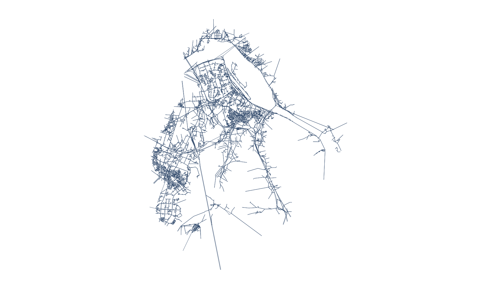
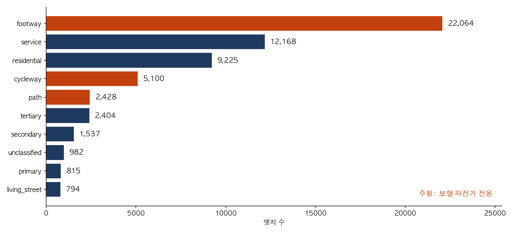
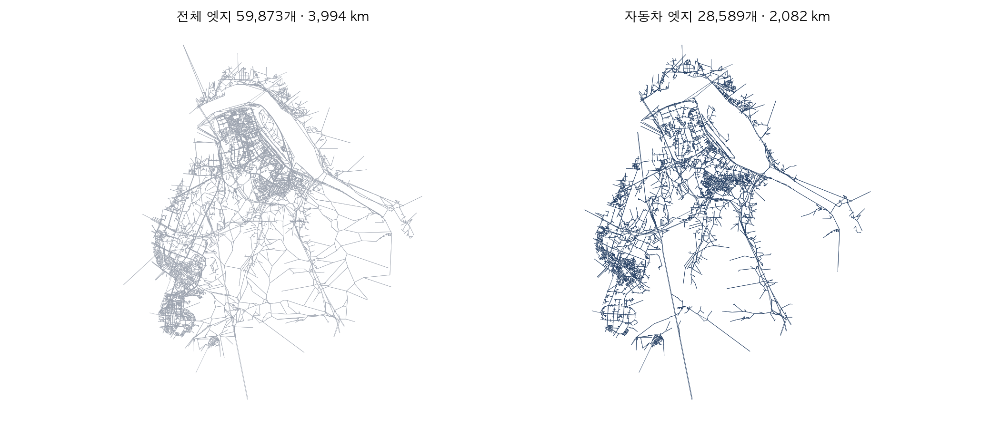
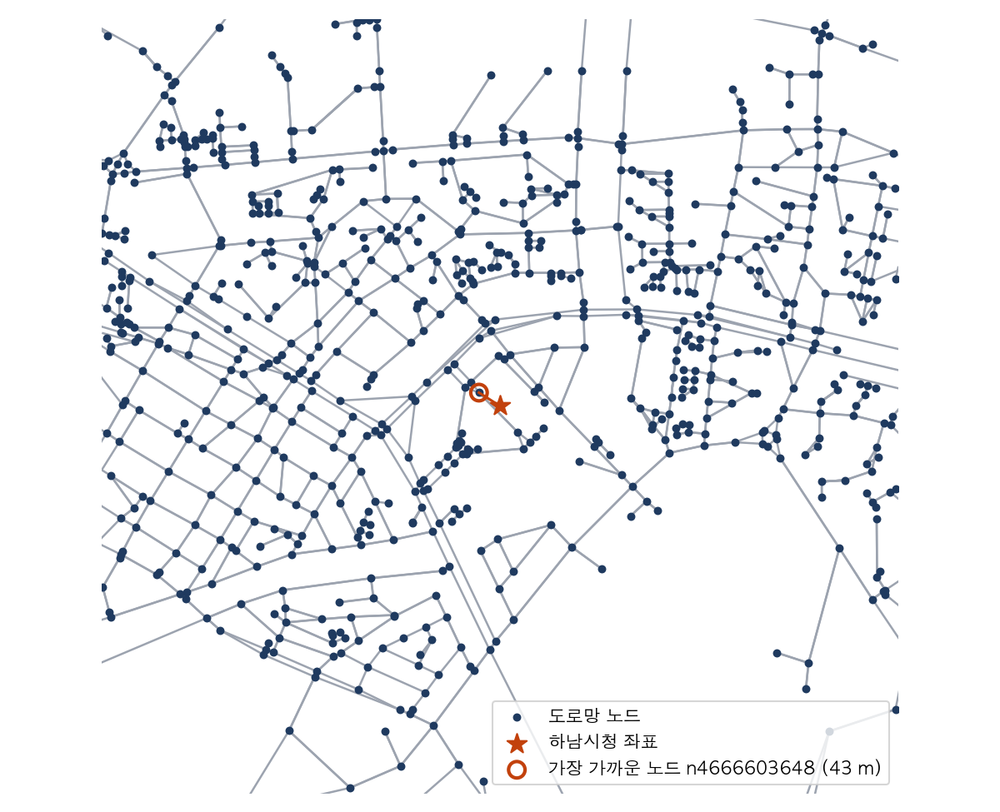

## 슬라이드 0 - 표지
제목: 2주차 — 도로망 데이터
부제: 스마트 교통물류 · 교재 2장
발표자: 여지호
소속: 가천대학교 스마트시티학과
발표날짜: 2026-09-08 (화) · 09-09 (수)
꼬리말: 스마트 교통물류 2026-2 · 2주차
section_slides: false

---
<!--
출처: mobility-simulation-book/ko/ch02_road_network.md, 서머리.md (2장).
화요일 = 2.1~2.3 개념 (약 15장), 수요일 = 2.4~2.6 실습 + HW1 (약 11장). 수치는 교재 값 그대로.
그림 ch02_*.png 는 slides/tools/make_figures.py 로 생성.
빌드: python3 ~/etc/slide-master/.claude/skills/academic-deck/scripts/md_to_pptx.py slides/week02.md --render
-->

## 화요일 — 도로망 데이터 (교재 2장 2.1~2.3)

### 오늘의 질문

- 0장에서 하남시청에서 미사역까지 차가 몇 분 걸리는지 시뮬레이터가 알아서 계산했습니다. 그 계산이 서 있는 바닥이 도로망입니다.
- 도로망은 "어느 지점에서 어느 지점으로, 몇 미터를, 시속 몇으로 갈 수 있는가"를 적어 놓은 표입니다.
- 오늘은 그 표를 직접 엽니다. 컬럼이 무엇을 뜻하는지, 무엇이 함정인지 확인합니다.
- 수요일에 3장에서 최단경로를 구할 수 있는 자료구조로 바꿉니다.

**그림 1. 하남시 도로망 — 노드 12,566개, 엣지 28,589개 (자동차 통행 기준)**



### 학습 목표

- OpenStreetMap 도로망의 노드 표와 엣지 표를 읽고 컬럼의 뜻을 설명합니다.
- 엣지 id에서 양 끝 노드를 파싱해 인접 리스트를 만듭니다.
- 통행수단에 맞게 엣지를 걸러 내고, 거르지 않으면 무슨 일이 생기는지 확인합니다.
- 좌표를 가장 가까운 노드에 붙이는 스냅을 KD-트리로 구현합니다.

### 2.1 도로망은 표 두 개입니다

- 하남시 도로망은 파일 두 개로 되어 있습니다. 노드 표와 엣지 표입니다.

```python
import pandas as pd
from smartmob.data import data_path

nodes = pd.read_parquet(data_path("hanam/road_graph_nodes.parquet"))
edges = pd.read_parquet(data_path("hanam/road_graph_edges.parquet"))
print(f"노드 {len(nodes):,}개, 엣지 {len(edges):,}개")
nodes.head(3)
```

- 노드는 지점입니다. 엣지는 두 지점을 잇는 구간입니다.

### 2.1 노드 표

| 컬럼 | 뜻 |
|---|---|
| `node_id` | OSM 번호 앞에 `n`을 붙인 문자열 |
| `lat`, `lon` | 위경도 |
| `node_type` | 지점의 성격. 거의 전부 교차로, `boundary`는 시 경계에서 잘린 지점 |

- 도로가 꺾이기만 하는 중간 지점은 노드로 두지 않습니다. 교차로와 교차로 사이를 엣지 하나로 묶어 두었기 때문입니다.
- `nodes["node_type"].value_counts()`로 확인합니다.

### 2.1 엣지 표

- `edges[["edge_id", "highway", "length", "free_flow_speed_kmh", "oneway"]].head(3)`으로 다섯 컬럼을 먼저 봅니다.

| 컬럼 | 뜻 |
|---|---|
| `edge_id` | 엣지 식별자. 양 끝 노드가 이 안에 들어 있습니다 (2.2절) |
| `highway` | 도로의 종류 (OSM 태그) |
| `length` | 미터 |
| `free_flow_speed_kmh` | 막히지 않을 때의 속도 |
| `oneway`, `direction` | 일방통행 여부, 정방향(`f`)/역방향(`r`) |

- `length`를 `free_flow_speed_kmh`로 나누면 그 도로를 지나는 데 걸리는 시간이 나옵니다. 3장에서 이 값을 최단경로의 비용으로 씁니다.

### 2.2 양 끝 노드는 어디에 있는가

- 여기서 처음 막힙니다. 엣지 표에 "출발 노드"와 "도착 노드" 컬럼이 없습니다. `source`도 `target`도 없습니다.
- 대신 `edge_id`를 봅니다. `e37375263_f_445273230_436257996`은 네 부분입니다.

| 부분 | 뜻 |
|---|---|
| `e37375263` | 이 엣지가 속한 OSM 도로(way)의 번호 |
| `f` | 방향. `f`는 정방향, `r`은 역방향 |
| `445273230` | 출발 노드의 OSM 번호 |
| `436257996` | 도착 노드의 OSM 번호 |

- 노드 표의 `node_id`는 OSM 번호 앞에 `n`을 붙인 것입니다. 뒤에서 두 조각을 떼면 양 끝 노드가 나옵니다.

### 2.2 파싱합니다

```python
def parse_edge_id(edge_id):
    _, source_osm, target_osm = edge_id.rsplit("_", 2)
    return f"n{source_osm}", f"n{target_osm}"

parse_edge_id("e37375263_f_445273230_436257996")
# ('n445273230', 'n436257996')
```

- `rsplit("_", 2)`는 오른쪽에서 두 번만 자릅니다. 도로 번호와 방향은 앞쪽에 붙은 채로 남습니다.
- 규칙을 짐작했습니다. 이제 맞는지 확인해야 합니다.

### 2.2 정말 맞는지 확인합니다

- 엣지 표에는 그 엣지가 지나는 OSM 노드 전체가 `osm_node_seq_json`에 들어 있습니다. 파싱한 값이 그 목록의 첫 번째와 마지막이어야 합니다.

```python
import json

sample = edges.head(2000)
mismatch = 0
for edge_id, seq in zip(sample["edge_id"], sample["osm_node_seq_json"]):
    seq = json.loads(seq) if isinstance(seq, str) else list(seq)
    u, v = parse_edge_id(edge_id)
    if u != f"n{seq[0]}" or v != f"n{seq[-1]}":
        mismatch += 1
print(f"2,000개 중 어긋난 것: {mismatch}개")   # 0개
```

- 하나도 어긋나지 않습니다. 이제 파싱을 믿고 쓸 수 있습니다.

### 2.2 규칙을 짐작했으면 그 자리에서 반증합니다

- 데이터를 처음 다룰 때 이런 확인을 건너뛰면, 몇 주 뒤에 원인을 알 수 없는 이상한 경로가 나옵니다.
- 규칙을 짐작했으면 그 자리에서 반증할 방법을 찾아 돌려 보는 것이 쌉니다. 이 과목에서 데이터를 다루는 태도가 이것입니다.
- 오늘 한 것: `edge_id`의 규칙을 짐작했고, `osm_node_seq_json` 2,000건과 대조해 0건 불일치를 확인했습니다.

### 2.2 f와 r은 무엇인가

- 양방향 도로는 두 방향이 각각 한 줄씩 들어 있습니다.

```python
print(edges["direction"].value_counts().to_dict())
print(edges["oneway"].value_counts().to_dict())
```

- 일방통행은 2,413개뿐이고 나머지는 양방향입니다. 양방향 도로 하나가 `f` 줄과 `r` 줄 두 개로 저장되어 있으므로, 각 줄을 그냥 단방향 엣지로 다루면 됩니다.

### 2.3 엣지의 절반은 자동차가 못 다닙니다

- `highway`는 도로의 종류입니다. 종류별로 세어 봅니다.
- 가장 많은 것이 `footway`(보도)입니다. 그 다음이 `service`(이면도로·주차장 진입로)와 `residential`(주택가 도로)입니다. `cycleway`(자전거도로)와 `path`(산책로)도 상위에 있습니다.

**그림 2. 하남시 엣지 59,873개의 `highway` 종류별 개수 (상위 10개)**



### 2.3 거르지 않으면 자동차가 계단으로 다닙니다

```python
walk_only = ["footway", "cycleway", "path", "steps", "pedestrian"]
n_walk = edges["highway"].isin(walk_only).sum()
print(f"보행·자전거 전용 엣지 {n_walk:,}개 ({n_walk / len(edges):.0%})")
```

- 보행·자전거 전용 엣지가 전체의 절반이 넘습니다. `footway`만 22,064개, `cycleway`가 5,100개입니다.
- 이걸 그대로 두고 자동차 최단경로를 구하면 계단으로 내려가고 산책로를 가로지르는 경로가 나옵니다. 거리는 짧지만 차는 못 갑니다.

### 2.3 통행수단에 맞는 highway만 남깁니다

```python
DRIVE = {
    "motorway", "motorway_link", "trunk", "trunk_link",
    "primary", "primary_link", "secondary", "secondary_link",
    "tertiary", "tertiary_link",
    "residential", "living_street", "unclassified", "service", "road",
}
drive_edges = edges[edges["highway"].isin(DRIVE)]
print(f"총 연장 {edges['length'].sum() / 1000:,.0f} km → {drive_edges['length'].sum() / 1000:,.0f} km")
```

- 3,994 km였던 것이 2,082 km로 줄었습니다. 나머지 1,912 km는 사람이 걷는 길입니다.

### 2.3 거르기 전과 후

- 왼쪽은 엣지 전체, 오른쪽은 자동차가 다닐 수 있는 엣지만 남긴 것입니다. 보도와 산책로가 빠지면서 주택가 안쪽의 촘촘한 선이 사라집니다.

**그림 3. 하남시 도로망 — 전체 엣지(왼쪽)와 자동차 통행 엣지(오른쪽)**



### 2.3 종류마다 속도가 다릅니다

```python
(drive_edges.groupby("highway")["free_flow_speed_kmh"]
            .median().sort_values(ascending=False).head(6))
```

- 고속도로가 100 km/h, 간선도로가 60 km/h, 주택가가 30 km/h 근처입니다.
- 이 값은 OSM의 `maxspeed` 태그에서 왔고, 태그가 없으면 도로 종류별 기본값으로 채워져 있습니다.
- 실제 주행 속도가 아니라 **막히지 않았을 때의 속도**입니다. 4장에서 시간대별 실측 속도로 바꿔 봅니다.

### 화요일 정리

- 도로망은 노드 표와 엣지 표 두 개입니다. 노드는 교차로, 엣지는 교차로 사이 구간입니다.
- 엣지의 양 끝 노드는 컬럼이 아니라 `edge_id` 안에 들어 있습니다. `rsplit("_", 2)`로 꺼내고, `osm_node_seq_json`과 대조해 확인했습니다.
- 엣지의 절반 이상이 보도·자전거도로입니다. `highway`로 걸러 내지 않으면 자동차가 인도로 다닙니다.
- 속도는 막히지 않을 때의 값입니다. 실측 속도는 4장에서 넣습니다.
- 수요일: 이 표를 인접 리스트로 바꾸고, 좌표를 노드에 붙입니다. 노트북에서 2장 코드가 돌아가는 상태로 옵니다.

## 수요일 — 인접 리스트와 스냅 (교재 2장 2.4~2.6, 실습)

### 오늘 만드는 것

1. 엣지 표를 인접 리스트로 바꿉니다. 비용은 소요시간입니다.
2. 좌표를 가장 가까운 노드에 붙이는 스냅을 전수 탐색과 KD-트리로 구현하고 속도를 비교합니다.
3. 하남시 도로망을 표 한 장으로 요약합니다.

- 끝나면 HW1(3주차 마감)의 절반은 되어 있습니다.

### 2.4 인접 리스트로 바꾸기

- 최단경로를 구하려면 "이 노드에서 갈 수 있는 곳이 어디인가"를 빠르게 답할 수 있어야 합니다. 표를 매번 훑을 수는 없으니, 노드마다 나가는 엣지의 목록을 미리 만들어 둡니다. 이것이 인접 리스트(adjacency list)입니다.
- 비용은 거리가 아니라 **소요시간**으로 둡니다. 200 m짜리 주택가 도로(30 km/h)와 200 m짜리 간선도로(60 km/h)는 거리가 같아도 시간이 두 배 차이 납니다.

| 구간 | 길이 | 속도 | 소요시간 |
|---|---|---|---|
| 주택가 도로 | 200 m | 30 km/h | 24초 |
| 간선도로 | 200 m | 60 km/h | 12초 |

### 2.4 코드

```python
from collections import defaultdict

coord = {r.node_id: (r.lat, r.lon) for r in nodes.itertuples(index=False)}
adj = defaultdict(list)

for edge_id, length_m, speed in zip(
    drive_edges["edge_id"], drive_edges["length"], drive_edges["free_flow_speed_kmh"]
):
    u, v = parse_edge_id(edge_id)
    if u not in coord or v not in coord:
        continue                      # 경계에서 잘려 한쪽 끝이 없는 엣지
    seconds = length_m / (max(speed, 1.0) * 1000 / 3600)
    adj[u].append((v, seconds))
    adj.setdefault(v, [])             # 들어오기만 하는 노드도 자리를 만들어 둡니다
```

- `adj["n445273230"][:4]`처럼 한 노드를 골라 어디로 몇 초에 이어지는지 확인합니다.

### 2.4 같은 코드가 smartmob에 있습니다

```python
from smartmob.data import load_road_graph

G = load_road_graph("hanam", modes=("drive",))
W = load_road_graph("hanam", modes=("walk",))
print(f"자동차: 노드 {G.n_nodes:,}  엣지 {G.n_edges:,}")
print(f"보행:   노드 {W.n_nodes:,}  엣지 {W.n_edges:,}")
```

- `modes` 인자가 방금 만든 `DRIVE` 필터에 해당합니다. `("walk",)`로 바꾸면 보행 네트워크가 나옵니다.
- 3장부터는 이걸 씁니다. 오늘 직접 만든 것과 노드·엣지 수가 같은지 대조합니다.

### 2.5 좌표를 노드에 붙이기

- 승객은 노드 위에서 택시를 부르지 않습니다. 아무 좌표에서나 부릅니다. 그 좌표를 가장 가까운 노드로 옮기는 것을 스냅(snapping)이라고 합니다.
- 가장 단순한 방법은 전부 훑는 것입니다.

```python
hanam_city_hall = (37.5393, 127.2148)

best, best_d = None, float("inf")
for node, (lat, lon) in coord.items():
    if node not in adj:
        continue
    d = (lat - hanam_city_hall[0]) ** 2 + (lon - hanam_city_hall[1]) ** 2
    if d < best_d:
        best, best_d = node, d
```

- 한 건에 수십 밀리초입니다. 시뮬레이션에서는 승객이 호출할 때마다 스냅해야 하므로, 1,000명이면 이것만으로 수십 초가 됩니다.

### 2.5 KD-트리

- 노드가 움직이지 않는다는 점을 이용합니다. 좌표를 한 번 KD-트리에 넣어 두면 그 뒤로는 훨씬 빠릅니다.

```python
from scipy.spatial import cKDTree

ids = list(adj)
tree = cKDTree([coord[n] for n in ids])
for _ in range(1000):
    _, idx = tree.query(hanam_city_hall)
print(ids[idx])        # 전수 탐색과 같은 노드, 1,000건이 순식간
```

- 같은 노드가 나오면서 1,000건이 순식간에 끝납니다. `G.nearest_node(lat, lon)`이 이 방식으로 되어 있습니다.
- 주의: KD-트리에 넣은 값은 위경도이고 거리를 위경도 차이로 잽니다. 한국 위도에서 경도 1도는 위도 1도보다 짧으므로 왜곡이 있습니다. 수백 미터 범위에서 가장 가까운 노드를 찾는 데는 문제가 없지만, 정확한 거리가 필요하면 하버사인으로 다시 계산합니다.

### 2.5 하남시청 좌표는 어느 노드에 붙는가

- 시청 좌표(37.5393, 127.2148)에서 가장 가까운 자동차 도로망 노드까지의 거리를 하버사인으로 잽니다.

**그림 4. 하남시청 주변 노드와 스냅된 노드**



### 2.6 실습: 도로망 한 장 요약

1. `nodes`, `edges`를 읽고 `DRIVE` 필터로 `drive_edges`를 만듭니다.
2. `parse_edge_id`로 인접 리스트 `adj`를 만들고 노드·엣지 수를 `load_road_graph`의 `G`와 대조합니다.
3. 아래 요약을 출력하고 값을 해석합니다.

```python
summary = {
    "노드 수": G.n_nodes,
    "엣지 수": G.n_edges,
    "총 연장(km)": round(drive_edges["length"].sum() / 1000, 1),
    "평균 엣지 길이(m)": round(drive_edges["length"].mean(), 1),
    "가장 긴 엣지(m)": round(drive_edges["length"].max(), 1),
    "평균 차수": round(G.n_edges / G.n_nodes, 2),
}
```

### 2.6 숫자 읽기

- 평균 차수가 2 근처입니다. 노드 하나에서 나가는 길이 평균 두 개라는 뜻이고, 도로망이 격자가 아니라 대부분 이어달리기 형태라는 것을 말해 줍니다.
- 가장 긴 엣지가 8.5 km입니다. 중간에 교차로가 하나도 없는 구간이므로 고속도로일 가능성이 큽니다. `drive_edges.nlargest(3, "length")`로 확인합니다.
- 총 연장 2,082 km는 화요일에 본 필터 결과와 같아야 합니다. 다르면 필터 집합을 다시 봅니다.

### 정리

- 도로망은 노드 표와 엣지 표 두 개입니다. 노드는 교차로, 엣지는 교차로 사이 구간입니다.
- 엣지의 양 끝 노드는 컬럼이 아니라 `edge_id` 안에 들어 있습니다. `rsplit("_", 2)`로 꺼냅니다.
- 엣지의 절반 이상이 보도·자전거도로입니다. `highway`로 걸러 내지 않으면 자동차가 인도로 다닙니다.
- 인접 리스트의 비용은 거리가 아니라 **소요시간**입니다. `length / speed`.
- 좌표를 노드에 붙일 때는 KD-트리를 한 번 만들어 둡니다.
- 3장에서 이 인접 리스트 위에서 최단경로를 구합니다. 다익스트라를 힙으로 약 90줄에 짭니다.

### 연습문제와 HW1

- **연습 2.1 ★** — `highway` 종류별 총 연장(km)을 구하고, 긴 순서로 상위 10개를 막대그래프로 그립니다. `smartmob.viz.use_korean_font()`를 먼저 부릅니다. 산출물: 막대그래프 1장, 상위 3개 종류 한 문장.
- **연습 2.2 ★★** — 보행 네트워크 `W`에서 가천대역(37.4498, 127.1263) 기준 도보 15분(5 km/h)에 닿는 노드를 찾아 지도에 그립니다. "이웃의 이웃"을 반복해 넓혀 가는 방식으로 풀어도 됩니다. 산출물: 도달 영역 지도 1장, 도달 노드 수.
- **연습 2.3 ★★★** — `geometry` 컬럼(WKB)을 `shapely`로 읽어 간선도로(`primary`, `secondary`)를 실제 형상으로 그리고, 직선으로 그렸을 때와 비교합니다. 산출물: 지도 2장, 차이 2~3줄.
- **HW1 (3주차 09-15 마감)** — 연습 2.1과 2.2를 제출합니다. 노트북(`.ipynb`) 하나에 코드·그림·설명 문장을 함께 넣습니다. 채점은 "돌아가는가"가 아니라 "`load_road_graph` 결과와 대조했는가, 숫자를 읽은 문장이 있는가"를 봅니다.

> 시간이 남으면 연습 2.3을 시연합니다. 직선 엣지와 실제 형상의 차이가 3장 최단경로의 거리 오차로 이어진다는 점을 예고합니다.
