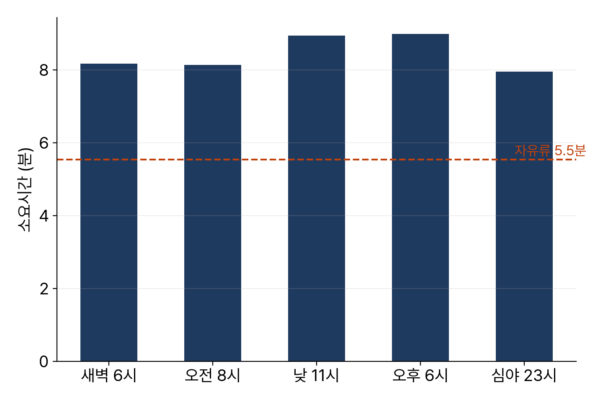

<!-- 덱 설계
청중: 가천대 스마트시티학과 학부 3학년. 3장에서 다익스트라를 직접 구현한 상태
시간: 100분 중 슬라이드 25분, 나머지 75분은 교재 4장을 화면에 표시하고 셀을 실행하며 진행 → 본문 11장
메시지: 속도를 실측으로 바꾸면 소요시간뿐 아니라 경로 자체가 바뀐다
목표: (1) 시간대별 속도 컬럼 교체 (2) 경로 변화 확인 (3) 결측 처리 방침 (4) 엔진이 필요한 이유
출처: mobility-simulation-book/ko/ch04_speeds_engine.md · 제외: 축약 계층 직접 구현, 시간의존 최단경로(연습 4.3)
구조: 섹션 = 교재 절. 4.2와 4.3을 한 섹션으로 통합했다
그림: figures/ch04_*.png 는 slides/tools/make_figures_week04.py 로 생성
빌드: ~/miniconda3/bin/python3 ~/.claude/skills/md2pptx/scripts/md2pptx.py slides/week04/ch04_speeds_engine.md
-->

# 도입과 학습 목표

## 오전 8시의 같은 구간

- 3장 결과: 하남시청에서 미사역까지 5분 34초
- 사용한 값은 free_flow_speed_kmh — 막히지 않을 때의 속도
- 제한속도에 가깝고, 실제로 그 속도가 나오는 시간대는 새벽뿐
- 이 장의 범위: 시간대별 실측 속도 적용과 엔진의 처리 방식

> 교재 4장 도입부. 3장 결과를 그대로 믿으면 저녁 시간대 시뮬레이션이 실제보다 낙관적으로 나온다는 점을 예고한다.

## 학습 목표

- 시간대별 속도 컬럼 적용과 소요시간 변화 측정
- 속도 변경이 최단경로 자체를 바꾼다는 점 확인
- 관측이 없는 엣지의 처리 방침 결정
- 시뮬레이션 질의 수 계산과 실제 엔진이 필요한 이유 설명

> 교재 4장 학습 목표와 같다. 두 번째 항목이 오늘의 중심이다.

## 교재와 실습을 여는 곳

표: 오늘 여는 파일과 경로
| 자료 | 경로 |
|---|---|
| 교재 원고 | ko/ch04_speeds_engine.md |
| 실습 노트북 | labs/ch04_speeds_engine.ipynb |

- 저장소: github.com/jihoyeo/mobility-simulation-book — blob/main 아래 경로
- 노트북 실행: jupyter lab labs/ch04_speeds_engine.ipynb
- 진행 순서: 슬라이드 개요 → 교재 본문 → 실습 노트북

> 슬라이드는 개요만 다룬다. 세부 내용과 코드는 교재 원고와 실습 노트북에서 확인한다. 교재 저장소는 비공개이므로 초대받은 계정으로 로그인한 상태여야 주소가 열린다.

# 교재 4.1 시간대별 속도 컬럼

## 여덟 개의 시간대

- weekday로 시작하는 여덟 개 컬럼이 주중 시간대별 관측 속도
  - offpeak 06–07 · am_peak 07–09 · am_shoulder 09–10 · midday 10–12
  - afternoon 12–17 · pm_peak 17–19 · pm_shoulder 19–22 · night 22–06
- 컬럼 이름의 p50은 중앙값
- 출처: 국가교통데이터베이스 계열의 속도 통계

> 2장에서 엣지 표를 확인할 때 지나쳤던 컬럼들이다. 교재에서 컬럼 목록을 다시 출력해 보여준다.

## 실측 속도와 결측 처리

표: 하남시 도로의 속도 통계
| 항목 | 값 |
|---|---|
| 자유류 중앙값 | 30 km/h |
| 실측 중앙값 범위 | 19~22 km/h |
| 가장 느린 시간대 | 오후 첨두 18.9 km/h |
| 관측 결측률 | 21.7% |

- 결측 엣지의 대부분은 이면도로와 주택가 도로
- 간선도로는 대부분 관측 존재
- 처리 방침: 결측은 자유류 속도로 대체

> 비워 두면 그 도로를 아예 사용할 수 없게 되므로 더 나쁘다. 결측이 이면도로에 몰려 있다는 점이 자유류 대체를 그럭저럭 타당하게 만든다. 연습 4.2에서 다른 대체 방식과 비교한다.

# 교재 4.2–4.3 소요시간과 경로 변화

## 시간대별 소요시간

- 자유류 5분 34초 → 오후 첨두 8분 59초
- 증가율 62%
- 자유류 기준선이 모든 시간대보다 아래

> 심야 7분 58초와 오후 첨두 8분 59초도 1분 차이가 난다. 하루 종일 같은 속도로 시뮬레이션하면 저녁 배차가 실제보다 잘 되는 것처럼 나온다.

## 경로 자체의 변화

- 실측 속도 적용 시 자유류와 다른 경로 선택
- 이유: 큰길이 정체되는 시간대에는 골목이 유리
- 무작위 50쌍 검증 — 오전 첨두와 심야에서 절반 가까이가 상이
- 최단경로 사전 계산의 한계: 시간대 수만큼 별도 저장 필요

> 최단경로를 미리 계산해 저장하면 되지 않느냐는 질문이 자연스럽게 나온다. 시뮬레이터는 이 문제를 다르게 해결하고, 4.5절에서 그 방법을 다룬다.

# 교재 4.4 질의 횟수

## 시뮬레이션 1회의 질의 수

표: 하남시 저녁 시뮬레이션 1회의 라우팅 질의량
| 항목 | 값 |
|---|---|
| 호출 건수 | 990건 |
| 대기 차량 평균 | 약 31대 |
| 질의 수 | 3만 회 이상 |
| 파이썬 다익스트라 소요 | 1회 7.4 ms · 합계 수 분 |

- 배차마다 질의: 대기 차량 중 최단 도착 차량 선택
- 실제 주행 경로 산출까지 포함하면 더 증가
- 차량 대수를 바꿔 20회 실행하면 한 시간 초과

> 파일럿 프로젝트에서 파라미터를 비교하려면 이 속도로는 부족하다. 다음 절의 엔진이 이 문제를 해결한다.

# 교재 4.5 실제 엔진

## 엔진이 다르게 하는 세 가지

- 축약 계층 사전 구축 — 질의당 확정 노드가 수백 개 수준
- 행렬 질의 — 승객 20명과 차량 30대를 600회가 아니라 20회 탐색으로 처리
  - 출발지 하나에서 모든 도착지까지 한 번에 계산하는 PHAST 방식
- 속도 배열만 교체 — 시간대 전환 시 그래프 재생성 없이 계층 갱신
  - 처음부터 재구축하는 것보다 다섯 배 빠름

> 세 가지 모두 직접 구현하지 않는다. 필요할 때 HTTP로 호출한다. 축약 계층은 3장 끝에서 예고한 그 방법이다.

## 우리 구현과의 대조

- 서버가 있으면 우리 다익스트라와 엔진 결과를 나란히 비교
- 완전히 일치하지는 않음
- 차이의 원인: 엔진은 승하차 시간과 회전 제한을 추가 반영
- 값이 크게 벌어지면 대부분 스냅된 노드가 서로 다른 경우

> 서버가 없으면 이 부분은 건너뛴다. 이 장의 나머지와 5장 이후는 서버 없이 진행된다.

# 교재 4.6 실습과 정리

## 오늘의 정리

- 실측 속도 적용 시 하남시청에서 미사역까지 62% 증가
  - 자유류 5분 34초 · 오후 첨두 8분 59초
- 소요시간뿐 아니라 경로 자체가 변경 — 무작위 쌍의 절반 가까이
- 관측 결측 21.7%는 자유류로 대체, 대부분 이면도로
- 시뮬레이션 1회에 3만 회 이상 질의 — 엔진이 필요한 이유

> 자유류 속도만 쓰는 시뮬레이션은 언제나 실제보다 낙관적인 결과를 낸다. 이 한 문장이 오늘의 결론이다.

## 연습과 다음 장

- 연습 4.1 ★ — 도로 종류별 자유류와 오후 첨두 속도 차이
  - 산출물: 종류별 비교표(자유류, 오후 첨두, 감소율) 상위 6행
- 연습 4.2 ★★ — 결측을 같은 도로 종류의 관측 중앙값으로 대체
  - 산출물: 두 방식의 소요시간, 선택과 근거 3~4줄
- 연습 4.3 ★★★ — 시간의존 최단경로 구현
- 다음 장: 5장 GTFS 대중교통 시간표

> 연습 4.3은 경로를 이동하는 동안 시각이 지나 시간대가 바뀌는 경우까지 반영한다. 오후 6시 50분에 출발해 7시를 지나는 상황이 예시다.
