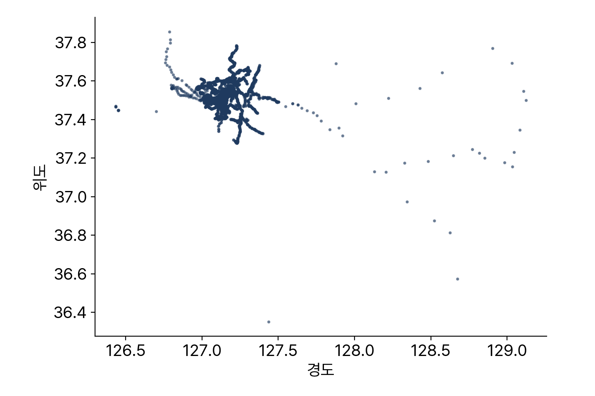

<!-- 덱 설계
청중: 가천대 스마트시티학과 학부 3학년. 도로망 최단경로까지 마친 상태, 대중교통 데이터는 처음
시간: 100분 중 슬라이드 20분, 나머지 80분은 교재 5장을 화면에 표시하고 셀을 실행하며 진행 → 본문 10장
메시지: 시간표가 있는 세계는 도로망과 규칙이 다르고, 한국 GTFS는 국제 명세와도 다르다
목표: (1) 다섯 개 표의 관계 (2) 한국 route_type 해석 (3) 24시 초과 시각 처리 (4) 노선 단위 경계 절단
출처: mobility-simulation-book/ko/ch05_gtfs.md · 제외: 코드 작성(교재에서), 노선 형상 shapes.txt
구조: 섹션 = 교재 절. 5.4와 5.5, 5.6과 정리를 각각 한 섹션으로 통합했다
그림: figures/ch05_*.png 는 slides/tools/make_figures_week04.py 로 생성
빌드: ~/miniconda3/bin/python3 ~/.claude/skills/md2pptx/scripts/md2pptx.py slides/week04/ch05_gtfs.md
-->

# 도입과 학습 목표

## 버스는 아무 때나 출발하지 않습니다

- 도로망만으로 계산 불가 — 버스에는 시간표가 존재
- 예시: 18:03 도착, 직전 차량이 18:01 출발 → 다음 차까지 대기
- 전 세계 대중교통 시간표의 공통 형식이 GTFS
- 이 장의 범위: GTFS 형식의 구조와 한국 데이터의 차이

> 교재 5장 도입부. 하남시청에서 미사역까지 버스로 몇 분 걸리는지가 이 장과 6장을 관통하는 질문이다.

## 학습 목표

- GTFS 다섯 개 표의 연결 관계 설명
- 한국 GTFS의 route_type이 국제 표준과 다르다는 점 확인과 해석
- 24시를 넘는 시각 표기 처리
- 경계 절단 시 노선 전체를 유지하는 방법

> 교재 5장 학습 목표와 같다. 두 번째와 세 번째는 한국 데이터를 다룰 때 반복해서 마주친다.

## 교재와 실습을 여는 곳

표: 오늘 여는 파일과 경로
| 자료 | 경로 |
|---|---|
| 교재 원고 | ko/ch05_gtfs.md |
| 실습 노트북 | labs/ch05_gtfs.ipynb |

- 저장소: github.com/jihoyeo/mobility-simulation-book — blob/main 아래 경로
- 노트북 실행: jupyter lab labs/ch05_gtfs.ipynb
- 진행 순서: 슬라이드 개요 → 교재 본문 → 실습 노트북

> 슬라이드는 개요만 다룬다. 세부 내용과 코드는 교재 원고와 실습 노트북에서 확인한다. 교재 저장소는 비공개이므로 초대받은 계정으로 로그인한 상태여야 주소가 열린다.

# 교재 5.1 표 다섯 개

## GTFS 다섯 개 표의 연결

표: 이 과목에서 사용하는 GTFS 다섯 개 표와 연결 키
| 표 | 담는 것 | 예시 | 연결 키 |
|---|---|---|---|
| routes | 노선 | 340번 버스 | route_id |
| trips | 운행 | 340번의 07:12 차 | trip_id |
| stop_times | 시각표 | 정류장별 정차 시각 | stop_id |
| stops | 정류장 | 이름과 위경도 | — |
| calendar | 운행일 | 다니는 요일 | — |

> GTFS는 텍스트 파일 여덟 개짜리 zip이고 이 책에서 쓰는 것이 다섯 개다. 위에서 아래로 routes에서 trips, stop_times, stops 순서로 이어진다.

## 노선과 운행의 구분

- 노선(route)과 운행(trip)은 다른 개념
  - 340번 버스는 노선 하나, 하루 수십 회 운행
  - 각 운행이 별개의 trip
- 하남 GTFS 최다 노선의 운행 수: 하루 293회 — 약 3분 간격
- 정류장 수: 4,203개

> 이 구분을 놓치면 6장에서 RAPTOR를 구현할 때 노선 단위 순회와 운행 단위 승차를 섞게 된다.

# 교재 5.2 한국의 route_type

## TAGO 코드와 국제 명세

표: route_type 값의 해석 차이와 하남 GTFS의 노선 수
| 값 | 국제 GTFS 명세 | 한국 TAGO 코드 | 하남 노선 수 |
|---|---|---|---|
| 0 | 트램 | 시내·농어촌·마을버스 | 132 |
| 1 | 지하철 | 도시철도 | 15 |
| 3 | 버스 | 시외버스 | 4 |

- 국제 명세대로 읽으면 하남시에 트램 132개 노선
- 오류 없이 실행되고 결과 숫자만 이상해짐
- 그 외 하남 데이터: 공항리무진 8개, 일반철도 6개

> route_type이 3인 것만 버스로 거르면 하남시 버스가 4개만 나온다. 다른 나라 데이터로 만든 코드를 한국 데이터에 그대로 쓰면 이런 일이 생긴다. 2장의 검증 습관이 여기서도 필요하다.

# 교재 5.3 24시 초과 시각

## 30시가 나오는 이유

- arrival_time은 HH:MM:SS 문자열 — 그대로 파싱하면 실패
- 하남 GTFS의 시 최댓값은 30 — 새벽 6시를 의미
- 24시 미만으로 적을 때의 문제
  - 23:50 출발, 00:20 도착이면 도착이 출발보다 이른 시각
  - 그날 밤차인지 다음날 첫차인지 구분 불가
- 24:20:00 표기의 효과: 시각 증가 유지, 운행일은 출발일로 고정

> 파싱은 자정부터의 초로 변환한다. 25:30:00은 다음 날 새벽 1시 30분이고 같은 운행일이다. smartmob.data.parse_gtfs_time이 이 일을 하고 6장에서 계속 쓴다.

# 교재 5.4–5.5 지도와 경계 절단

## 정류장 분포

- 하남시 경계 밖까지 넓게 분포
- 이유: 하남시를 지나는 노선의 정류장 전체가 포함
- 예시: 340번이 서울 강변역까지 가면 강변역 정류장도 포함

> 위도 37도에서는 경도 1도가 위도 1도보다 짧아서 종횡비를 보정해야 지도 모양이 맞는다.

## 노선 단위 절단

- 정류장 기준 절단의 문제: 경계에서 노선이 끊김
  - 340번의 정류장이 안에 10개, 밖에 15개면 10개짜리 노선이 됨
  - 실제로 갈 수 있는 곳을 못 간다고 응답
- 노선 단위 절단 순서
  - 경계 안 정류장 → 그 정류장을 지나는 운행 → 그 운행의 노선 → 그 노선의 운행 전부
- 버퍼 500 m 적용 — 경계 30 m 밖 정류장도 사실상 그 동네의 정류장

> smartmob.data.gtfs.clip_to_boundary가 이 순서로 되어 있다. 기말 프로젝트에서 무당이 GTFS를 다룰 때 같은 문제를 겪는다.

# 교재 5.6 실습과 정리

## 오늘의 정리

- 표 연결: routes에서 trips, stop_times, stops 순서
  - 노선과 운행은 다름 — 340번은 노선 하나, 하루 수십 회 운행
- 한국 route_type은 TAGO 코드 — 0은 시내버스이고 트램이 아님
- 시각은 24시를 넘음 — 25:30:00은 다음 날 새벽이고 같은 운행일
- 경계 절단은 정류장이 아니라 노선 단위

> 실습에서 하남시청 정류장을 지나는 노선과 각 노선의 운행 수를 계산한다. 그것이 그 정류장의 공급 수준이고, 기말 프로젝트에서 무당이에 대해 같은 계산을 한다.

## 연습과 다음 장

- 연습 5.1 ★ — 첫차와 막차 시각, 24시 초과 표기 처리
  - 산출물: 첫차 시각, 막차 시각, 처리 방식 한 문장
- 연습 5.2 ★★ — 시간대별 운행 편수 히스토그램
  - 산출물: 히스토그램 1장, 첨두 시간대와 심야 운행 유무 2~3줄
- 연습 5.3 ★★★ — 노선별 정류장 순서의 종류 수
- 다음 장: 6장 RAPTOR 직접 구현 — 직접 구현 세 개 중 두 번째

> 연습 5.3의 순서가 같은 운행 묶음이 6장에서 중요해진다. 한 노선에 여러 순서가 나오는 이유는 상행과 하행, 지선, 회차다.
