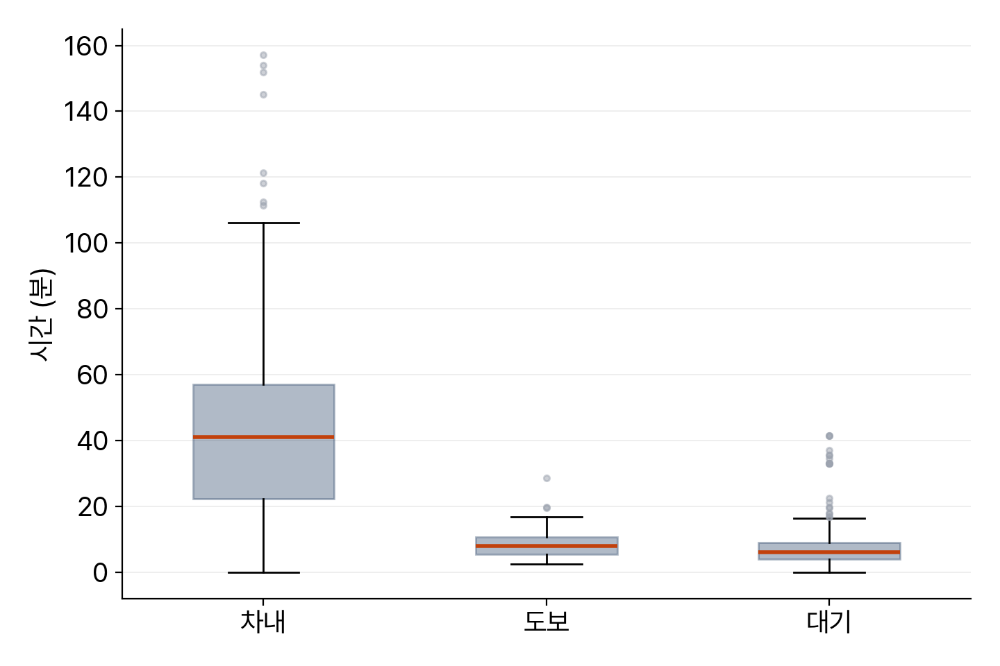

<!-- 덱 설계
청중: 가천대 스마트시티학과 학부 3학년. RAPTOR를 직접 구현한 상태
시간: 화 100분(파라미터·요금) + 수 100분(지표 분포·대조). 각 날 슬라이드 25분 → 본문 13장
메시지: 6장에서 정하지 않고 넘어간 값들이 결과를 크게 바꾸고, 평균 하나로는 그것이 보이지 않는다
목표: (1) 환승 횟수와 도보 거리의 영향 측정 (2) 통합환승요금 구현과 검산 (3) 여섯 지표의 분포 (4) 엔진 대조
출처: mobility-simulation-book/ko/ch07_raptor_fare.md · 제외: 30분 환승 제한(연습 7.3), 할증·할인 규칙
구조: 섹션 = 교재 절. 7.1-7.2, 7.4-7.5, 7.6-7.7을 각각 한 섹션으로 통합했다
그림: figures/ch07_*.png 는 slides/tools/make_figures_week06.py 로 생성
빌드: ~/miniconda3/bin/python3 ~/.claude/skills/md2pptx/scripts/md2pptx.py slides/week06/ch07_raptor_fare.md
-->

# 도입과 학습 목표

## 정하지 않고 넘어간 값들

- 6장 결과: 하남시청에서 미사역까지 23분, 도보 11분, 대기 5분
- 그 계산에서 확정하지 않은 값 세 가지
  - 환승 허용 횟수
  - 도보 환승 허용 거리
  - 통행 요금
- 이 장의 범위: 값을 정하고, 그 값이 결과를 얼마나 바꾸는지 측정

> 교재 7장 도입부. 파라미터를 임의로 정하는 대신 측정하고 정하는 태도가 이 장의 주제다.

## 학습 목표

- 환승 허용 횟수와 도보 환승 거리가 결과에 미치는 영향 측정
- 수도권 통합환승요금 구현과 손 검산
- 통행시간, 차내, 도보, 대기, 환승, 요금 여섯 지표의 분포 확인
- 평균으로는 보이지 않는 것을 분포에서 발견

> 교재 7장 학습 목표와 같다. 네 번째가 이 장에서 가장 오래 남는 부분이다.

## 교재와 실습을 여는 곳

표: 오늘 여는 파일과 경로
| 자료 | 경로 |
|---|---|
| 교재 원고 | ko/ch07_raptor_fare.md |
| 실습 노트북 | labs/ch07_raptor_fare.ipynb |

- 저장소: github.com/jihoyeo/mobility-simulation-book — blob/main 아래 경로
- 노트북 실행: jupyter lab labs/ch07_raptor_fare.ipynb
- 진행 순서: 슬라이드 개요 → 교재 본문 → 실습 노트북

> 슬라이드는 개요만 다룬다. 세부 내용과 코드는 교재 원고와 실습 노트북에서 확인한다. 교재 저장소는 비공개이므로 초대받은 계정으로 로그인한 상태여야 주소가 열린다.

# 교재 7.1–7.2 환승 파라미터

## 환승 허용 횟수

표: 환승 허용 횟수별 도달 정류장 수 (하남시청 오전 8시 출발)
| 허용 환승 | 도달 정류장 |
|---|---|
| 0회 | 1,679개 |
| 1회 | 4,152개 |
| 2회 이상 | 4개 추가에 그침 |

- 하남 규모에서는 환승 1회로 대부분 도달
- 최대 라운드를 크게 설정하면 계산량만 증가
- 대상지를 넓히면 결과가 달라짐 — 프로젝트에서 먼저 측정

> 값을 임의로 두는 것보다 측정하고 두는 편이 낫다. 파일럿 프로젝트에서 대상지를 정한 뒤 이 실험을 먼저 한다.

## 도보 환승 허용 거리

- 200 m에서 1,000 m로 확대 시 환승 쌍 12배, 도달 정류장은 15개 증가
- 실제로 변하는 것은 도달 여부가 아니라 도착 시각
- 확대의 대가: 실제로 걷기 어려운 환승이 포함
- 채택값 500 m — 도보 약 7분, 사람이 감수하는 수준

> 우리 도보 환승은 직선거리 기반이라 강이나 철길로 막힌 두 정류장에도 환승이 생성된다. 이 오류는 거리를 늘릴수록 심해진다. 거리를 늘리려면 보행 네트워크로 실제 경로를 확인해야 한다.

# 교재 7.3 통합환승요금

## 세 줄 규칙

표: 수단별 기본요금과 거리 초과 요금
| 수단 | 기본요금 | 초과 5 km당 |
|---|---|---|
| 버스 | 1,500원 | 100원 |
| 도시철도 | 1,550원 | 100원 |
| GTX | 3,200원 | 250원 |

- 탄 수단 중 기본요금이 가장 비싼 것 하나만 부과
- 총 이동거리 10 km까지는 기본요금만
- 10 km 초과분은 5 km 단위로 올림해 가산

> 타는 횟수 곱하기 기본요금이 아니다. 버스에서 지하철로 갈아타도 1,550원 한 번만 낸다. 이것이 통합요금의 요점이다.

## 손 검산

- 예시: 버스 4 km + 지하철 12 km = 총 16 km
  - 기본요금은 더 비싼 지하철 1,550원
  - 초과 6 km를 5 km 단위로 올림 → 2블록 × 100원
  - 합계 1,750원
- 15.1 km와 20 km의 요금이 같은 이유: 올림 처리

> 6장에서 구한 하남시청에서 미사역까지의 통행은 3.4 km라 기본요금 1,550원이다. 버스와 지하철을 둘 다 탔지만 한 번만 낸다. 이 구현은 성인 카드 기준이고 광역버스 할증, 심야 할증, 연령 할인, 30분 환승 제한을 포함하지 않는다.

# 교재 7.4–7.5 지표 분포

## 평균과 중앙값의 차이

표: 도달 가능한 정류장 300개 표본의 통행시간
| 통계 | 값 |
|---|---|
| 평균 | 65분 |
| 표준편차 | 66분 |
| 중앙값 | 56분 |
| 최댓값 | 1,007분 |

- 최댓값 16시간은 오류가 아님 — 다음 날 첫차 대기
- 해당 사례는 하루 몇 회만 운행하는 시외 노선의 종점
- 3시간 초과 통행에서는 대기시간이 대부분
- 대표값으로는 중앙값 56분이 타당

> 분포를 확인하지 않고 평균만 보고했다면 하남시 평균 통행시간 65분이라는 틀린 결론을 냈을 것이다. 1장에서 확인한 41분 승객과 같은 구조의 문제다.

## 시간 구성

- 차내시간은 넓게 분포, 도보와 대기는 좁게 집중
- 해석: 목적지가 멀수록 차내시간 증가, 도보와 대기는 목적지와 무관
- 구성비 — 차내 72.5%, 도보 14.3%, 대기 13.2%

> 어디를 가든 걷는 시간과 기다리는 시간은 비슷하다는 뜻이다.

## 개선 방향의 근거

- 선택지 1: 버스 속도 향상 — 차내시간 단축
- 선택지 2: 배차간격 단축 — 대기시간 단축
- 대기 비중이 이 수준이면 배차 개선의 여지가 큼
- 기말 프로젝트 시나리오 선택 시 이 분해를 근거로 사용

> 숫자에서 정책으로 넘어가는 지점이다. 학생들에게 어느 쪽을 택할지 먼저 말하게 하고 근거를 요구한다.

# 교재 7.6–7.7 환승·요금과 엔진 대조

## 환승 횟수와 요금의 관계

- 300개 표본 중 환승 0회는 24개 — 대부분 1회에서 3회
- 환승 증가 시 통행시간은 증가
- 환승 증가에도 요금은 거의 불변
- 이유: 통합요금은 횟수가 아니라 거리에만 반응

> 요금이 환승을 억제하지 않는다는 뜻이다. 그런데도 사람들이 환승을 꺼리는 이유는 시간과 불편이다. 실제 엔진은 이것을 환승 저항으로 비용에 반영한다.

## 실제 엔진과의 대조

- 서버가 있으면 우리 RAPTOR와 엔진 결과를 나란히 비교
- 차이의 원인
  - 엔진은 도보 환승을 보행 네트워크로 계산
  - 승하차 소요시간 반영, 환승 저항을 비용에 포함
- 판단 기준: 5분 차이면 대체로 정확, 30분 차이면 구현 오류
- 파일럿 프로젝트 제출물에 이 대조표가 포함

> 정확히 같은 값을 요구하지 않는다. 얼마나 다른지와 그 차이를 설명할 수 있는지가 채점 기준이다.

# 정리와 연습

## 오늘의 정리

- 하남에서는 환승 1회로 도달 정류장이 1,679개에서 4,152개로 증가
- 도보 환승 거리 확대는 도달 정류장을 거의 늘리지 못하고 오류만 증가
- 통합환승요금: 가장 비싼 기본요금 1회 + 10 km 초과분 5 km당 100원
- 통행시간의 27.5%가 도보와 대기 — 배차 개선의 여지

> 평균 65분과 중앙값 56분의 차이가 오늘의 결론이다. 8장에서는 한 사람의 경로가 아니라 수천 명의 수요를 만든다.

## 연습과 다음 장

- 연습 7.1 ★ — 세 가지 통행의 요금 계산과 손 검산
  - 산출물: 각 요금과 계산 과정
- 연습 7.2 ★★ — 출발지를 미사역으로 변경한 300개 표본 비교
  - 산출물: 두 출발지의 지표 비교표, 원인 설명 4~5줄
- 연습 7.3 ★★★ — 30분 환승 제한 규칙 구현
- 다음 장: 8장 통행 수요 생성

> HW2가 이번 주 마감이다. 직접 구현한 RAPTOR와 참조 결과의 대조표를 제출한다. 기말 팀 프로젝트도 이번 주에 시작하므로 팀 구성과 시나리오 배정을 진행한다.
