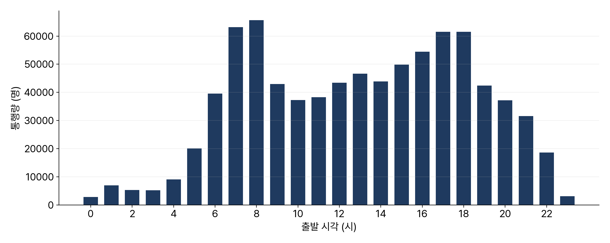
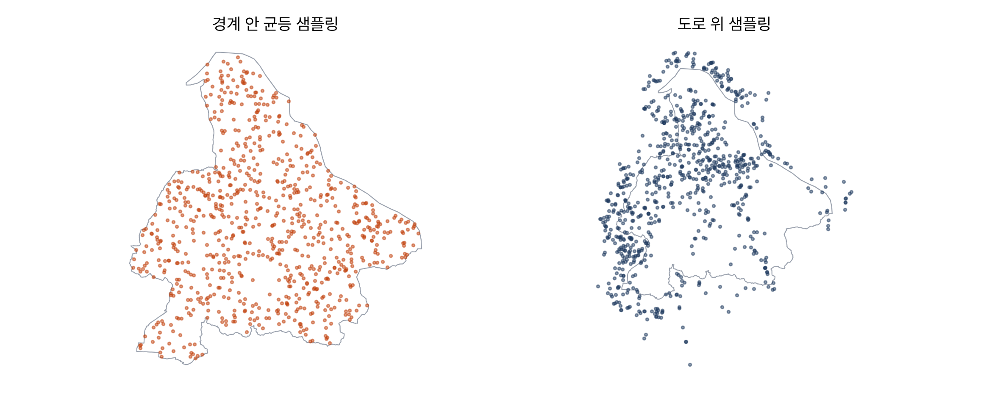

<!-- 덱 설계
청중: 가천대 스마트시티학과 학부 3학년. 지금까지 한 사람의 경로만 다뤄 온 상태
시간: 100분 중 슬라이드 25분, 나머지 75분은 교재 8장을 화면에 표시하고 셀을 실행 → 본문 12장
메시지: 집계된 O-D를 개인 목록으로 변환하는 과정이 수요 생성이고, 세 단계로 그럴듯해진다
목표: (1) O-D 데이터의 시공간 패턴 (2) 시뮬레이터 수요 형식 (3) 생성 3단계 비교 (4) 시간대 프로파일 적용
출처: mobility-simulation-book/ko/ch08_demand.md · 제외: 코드 작성(교재에서), O-D 쌍 가중 샘플링(연습 8.2)
구조: 섹션 = 교재 절. 8.1-8.3과 8.5-8.7을 각각 한 섹션으로 통합했다
그림: figures/ch08_*.png 는 slides/tools/make_figures_week07.py 로 생성
빌드: ~/miniconda3/bin/python3 ~/.claude/skills/md2pptx/scripts/md2pptx.py slides/week07/ch08_demand.md
-->

# 도입과 학습 목표

## 승객 990명의 출처

- 0장 시뮬레이션의 승객 990명 — 출발지와 도착지를 누가 정했는지 미확인
- 지금까지 다룬 것은 한 사람의 경로
- 시뮬레이션에 들어가는 것은 수천 명
- 이 장의 범위: 수요 데이터 확인, 형식 이해, 데이터가 없을 때의 생성

> 교재 8장 도입부. 지금까지 만든 경로 탐색이 개인 단위였다면, 오늘부터는 집단 단위로 넘어간다.

## 학습 목표

- 수도권 생활이동 O-D 데이터의 시간대와 공간 패턴 추출
- 시뮬레이터가 받는 수요 형식 다섯 개 컬럼 이해
- 수요 생성기 세 단계 비교와 각 단계의 개선 내용 설명
- 실제 데이터에서 추출한 시간대 프로파일로 수요 생성

> 교재 8장 학습 목표와 같다. 기말 프로젝트에서 무당이 수요를 만들 때 이 절차를 그대로 쓴다.

## 교재와 실습을 여는 곳

표: 오늘 여는 파일과 경로
| 자료 | 경로 |
|---|---|
| 교재 원고 | ko/ch08_demand.md |
| 실습 노트북 | labs/ch08_demand.ipynb |

- 저장소: github.com/jihoyeo/mobility-simulation-book — blob/main 아래 경로
- 노트북 실행: jupyter lab labs/ch08_demand.ipynb
- 진행 순서: 슬라이드 개요 → 교재 본문 → 실습 노트북

> 슬라이드는 개요만 다룬다. 세부 내용과 코드는 교재 원고와 실습 노트북에서 확인한다. 교재 저장소는 비공개이므로 초대받은 계정으로 로그인한 상태여야 주소가 열린다.

# 교재 8.1–8.3 O-D 데이터와 패턴

## O-D 표의 구조

표: 수도권 생활이동 O-D 데이터의 컬럼
| 컬럼 | 뜻 |
|---|---|
| O_ADMDONG_CD · D_ADMDONG_CD | 출발·도착 행정동 코드 |
| ST_TIME_CD | 출발 시간대 0~23시 |
| CNT | 통행량, 추정치라 소수점 존재 |
| MOVE_DIST · MOVE_TIME | 평균 이동거리와 이동시간 |

- 출처: 통신사 기지국 접속 기록
- 행 하나의 의미: 이 동에서 저 동으로, 이 시간대에, 몇 명
- 이동거리 중앙값 5.2 km · 이동시간 중앙값 20분

> 개인 기록이 아니라 집계값이라는 점이 중요하다. 8시 12분에 미사동에서 출발했다는 정보는 없고, 8시대에 미사동에서 신장동으로 47.3명이 갔다는 정보만 있다.

## 시간대 패턴

- 봉우리 두 개 — 오전 7~8시가 최고, 오후 5~6시가 그다음
- 최저 시간대는 새벽 3~4시
- 0장에서 저녁 6시부터 자정을 선택한 근거

> 통행이 많으면서 하루를 전부 실행하지 않아도 되는 구간이라 그 시간대를 골랐다.

## 공간 패턴

- 하남 출발 통행의 54%가 하남 안에서 종료
- 나머지 절반의 목적지: 서울 동남권(강동·송파·강남)과 인접 시군
- 경계 설정의 영향
  - 하남 경계 안만 다루면 통행의 절반 누락
  - 수도권 전체를 다루면 데이터와 계산량이 크게 증가
- 결정 기준: 답하려는 질문

> 행정동 코드 앞 다섯 자리가 시군구다. 이 54%라는 숫자가 시뮬레이션 대상 범위를 정하는 근거가 된다. 기말 프로젝트에서 무당이는 캠퍼스 안에서 끝나므로 사정이 다르다.

# 교재 8.4 시뮬레이터 수요 형식

## 다섯 개 컬럼과 검증

- 시뮬레이터는 집계표가 아니라 개인 목록을 입력받음
- 컬럼 다섯 개: request_time과 출발·도착 위경도 네 개
- request_time은 자정부터의 분 — 1080이 18:00
- 검증 함수가 잡아 주는 실수
  - 분 단위를 초 단위로 입력한 경우
  - 위도와 경도를 서로 바꿔 입력한 경우

> 단위를 틀리면 오류 없이 이상한 결과가 나온다. 그래서 형식 검증을 계약처럼 강제한다. 기말 프로젝트 제출물도 이 검증을 먼저 통과해야 한다.

# 교재 8.5–8.7 수요 생성 세 단계

## 1단계 경계 안 균등 샘플링

- 방법: 행정 경계 안에 점을 고르게 배치
- 결과: 경계 전체에 균등 분포
- 문제: 검단산 중턱과 한강 위에도 호출이 생성
- 판단: 가장 단순하지만 그럴듯하지 않음

> 산 중턱에서 택시를 부르는 사람은 없다. 지도를 보여주면 학생들이 먼저 문제를 발견한다.

## 2단계 도로 위 샘플링

- 방법: 2장의 도로망 위에서만 추출, 도로 길이에 비례한 가중치
- 결과: 산과 강이 비고 시가지에 집중
- 숨은 가정: 도로가 많은 곳에 사람이 많음

> 대체로 맞지만 항상은 아니다. 고속도로 구간은 도로가 길지만 거기서 택시를 부르지 않는다. 가정을 명시하고 넘어가는 것이 이 과목의 방식이다.

## 3단계 시간대 프로파일 반영

- 앞의 두 단계는 시간에 대해 균등 — 출퇴근 첨두가 없음
- 방법: O-D 데이터에서 시간대 비중을 추출해 호출 시각에 적용
- 결과: 오전 7~8시와 오후 5~6시에 봉우리 재현
- 검증: 생성한 수요도 형식 검증을 통과해야 함

> 8.2절의 실제 통행량 그래프와 생성된 수요의 모양이 같은지 나란히 확인한다. 같지 않으면 프로파일 적용이 잘못된 것이다.

# 교재 8.8 엔진 투입

## 만든 수요로 시뮬레이션 실행

- 순서: 수요 생성 → 서버 업로드 → 조건을 바꿔 반복 실행
- 업로드 함수가 내부에서 형식 검증을 먼저 수행
- 형식이 틀린 수요는 업로드 단계에서 차단
- 기말 프로젝트도 같은 순서로 진행

> 형식이 틀린 수요가 서버에 올라가 이상한 결과를 내는 것보다 올리기 전에 막히는 편이 낫다. 서버가 없으면 이 절은 건너뛴다.

# 정리와 연습

## 오늘의 정리

- O-D 표는 집계 자료 — 개인 기록이 아니므로 개인 단위로 분해 필요
- 하남 통행은 오전 7~8시와 오후 5~6시에 봉우리, 54%가 하남 안에서 종료
- 시뮬레이터 수요 형식은 호출 시각과 출발·도착 좌표 다섯 개
- 생성 3단계: 경계 안 균등 → 도로 위 → 시간대 프로파일 반영

> 도로 위 샘플링의 가정을 다시 언급하고 넘어간다. 오후에는 12장으로 이동해 결과를 읽는 방법을 다룬다.

## 연습과 다음 장

- 연습 8.1 ★ — 통행량 상위 행정동 쌍 10개, 오전과 저녁의 순서 역전
  - 산출물: 시간대별 상위 10쌍 표, 역전의 의미 2~3줄
- 연습 8.2 ★★ — 출발지와 목적지를 쌍으로 추출하도록 개선
  - 산출물: 구현 코드, 기존 방식과의 통행거리 분포 비교 그래프
- 연습 8.3 ★★★ — 하남시 하루 택시 수요 추정과 민감도 분석
- 다음: 오후에 12장 지표와 결과 읽기

> 연습 8.3은 가정을 전부 명시하고 가정 하나를 바꿨을 때 결과 범위를 제시하는 과제다. 기말 프로젝트 보고서에서 요구하는 형식과 같다.
