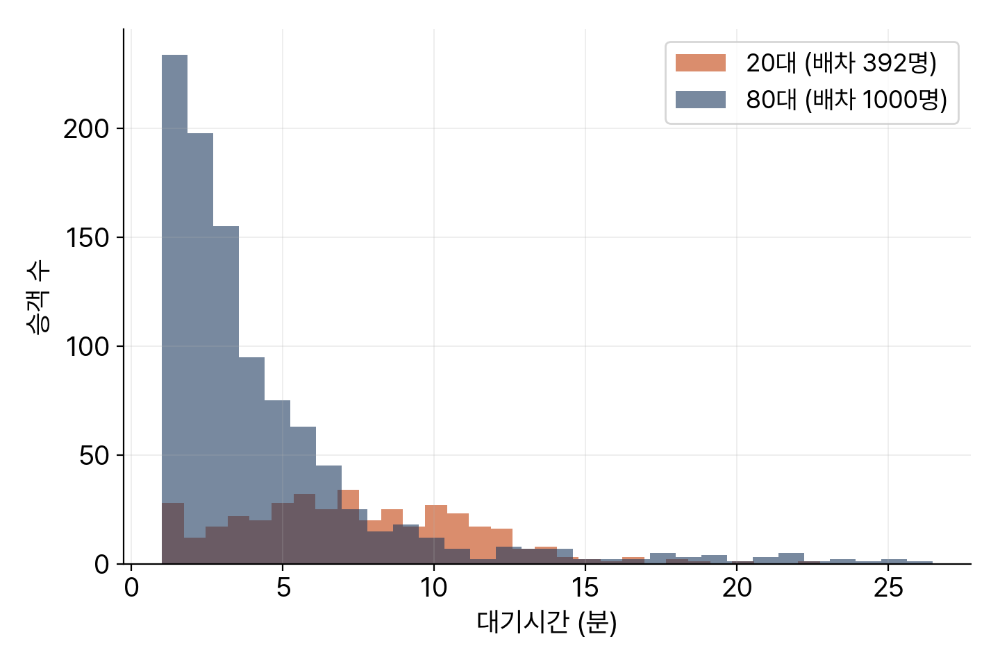
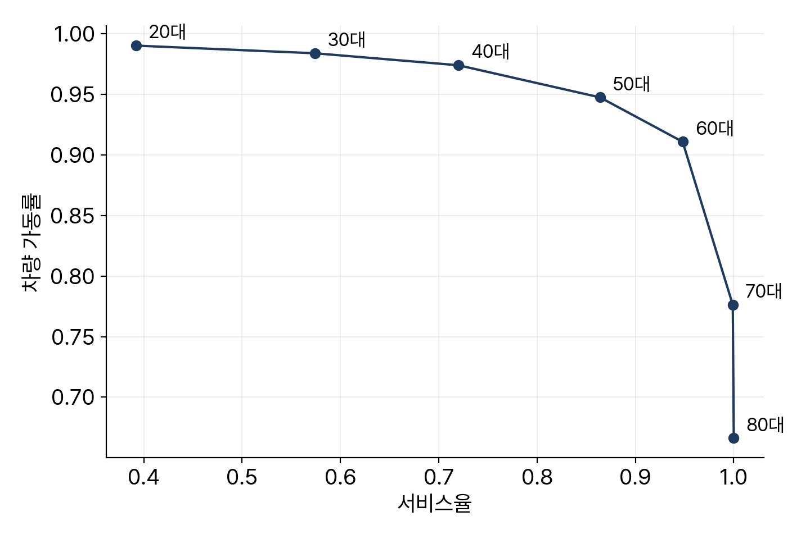

<!-- 덱 설계
청중: 가천대 스마트시티학과 학부 3학년. 중간시험 범위의 마지막 장이고 기말 프로젝트 진행 중
시간: 100분 중 슬라이드 25분, 나머지 75분은 교재 12장을 화면에 표시하고 셀을 실행 → 본문 13장
메시지: 대기시간은 배차받은 사람만 계산되므로 서비스율과 함께 보지 않으면 결론이 뒤집힌다
목표: (1) 세 관점의 지표 (2) 생존 편향 (3) 파레토 프론트 비교 (4) 보고서 구성
출처: mobility-simulation-book/ko/ch12_metrics.md · 제외: pydeck 재생 실습, 공간 형평성 지표(연습 12.3)
구조: 섹션 = 교재 절. 12.2-12.3, 12.4-12.5, 12.6-12.7을 각각 한 섹션으로 통합했다
그림: figures/ch12_*.png 는 slides/tools/make_figures_week07.py 로 생성
빌드: ~/miniconda3/bin/python3 ~/.claude/skills/md2pptx/scripts/md2pptx.py slides/week07/ch12_metrics.md
-->

# 도입과 학습 목표

## 이상한 줄이 있는 표

- 차량 20대의 평균 대기시간 7.32분, 60대는 7.21분
- 차량을 세 배로 늘렸는데 대기시간이 거의 동일
- 20대 시나리오에서 승객의 61%가 배차 실패
- 숫자가 틀린 것이 아니라 읽는 방법이 틀린 상황

> 교재 12장 도입부. 이 표가 왜 이렇게 나오는지가 오늘의 주제다. 학생들에게 먼저 원인을 추측하게 한다.

## 학습 목표

- 지표를 승객, 운영자, 도시 세 관점으로 구분
- 평균 하나로 판단할 때 생기는 편향 발견
- 시나리오 여러 개를 한 표로 비교하고 파레토 프론트 작성
- 차량 이동 기록을 지도로 재생해 공간 문제 확인

> 교재 12장 학습 목표와 같다. 두 번째가 기말 프로젝트 보고서에서 가장 자주 문제가 되는 부분이다.

# 교재 12.1 지표 세 무리

## 관점별 지표

표: 세 관점이 확인하는 것과 대응 지표
| 관점 | 확인하는 것 | 지표 |
|---|---|---|
| 승객 | 탑승 여부와 대기 시간 | 서비스율, 대기시간 중앙값·90분위·최댓값 |
| 운영자 | 차량 가동과 처리량 | 가동률, 차량당 처리 건수 |
| 도시 | 도로 사용량 | 총 주행거리, 공차 비율 |

- 기준 실행 결과: 서비스율 1.0, 대기 중앙값 3.05분, 90분위 8.27분
- 최댓값 26.45분, 가동률 0.67, 공차 비율 0.19
- 공차 비율의 뜻: 승객 없이 도로를 사용한 거리의 비중

> 1장에서 확인한 세 관점이 여기서 지표로 구체화된다. 마지막 값이 도시가 관심을 두는 부분이다.

# 교재 12.2–12.3 생존 편향과 분포

## 대기시간이 줄지 않는 이유

표: 차량 대수별 평균 대기시간과 서비스율
| 차량 | 평균 대기 | 서비스율 |
|---|---|---|
| 20대 | 7.32분 | 0.39 |
| 60대 | 7.21분 | — |
| 80대 | 4.28분 | 1.00 |

- 대기시간은 배차에 성공한 승객만 계산 대상
- 차량이 적으면 가까운 승객만 배차되고 먼 승객은 포기 처리
- 남은 승객의 평균 대기가 짧게 산출 — 생존 편향

> 이 함정이 프로젝트 보고서에서 가장 자주 나온다. 차량을 줄였는데 대기시간이 그대로였다는 결론을 보면 먼저 서비스율을 확인하게 한다.

## 포기 승객을 세는 방법

- 방법 1: 배차된 승객만 집계
- 방법 2: 포기 승객에게 벌점 시간 부여 — 예를 들어 30분
  - 20대 시나리오가 21분 초과, 80대는 4.28분 — 순위 역전
- 선택 기준은 답하려는 질문
  - 택시를 탄 사람의 대기 시간 → 방법 1
  - 이 지역에서 택시를 부를 때의 소요 → 방법 2
- 보고서 원칙: 서비스율과 대기시간을 항상 함께 기재

> 둘 다 맞는 방법이고 답하려는 질문이 다르다. 하나만 적으면 읽는 사람이 잘못 이해한다. 연습 12.2에서 벌점 값을 바꿔 순위가 뒤집히는 지점을 찾는다.

## 분포로 확인하기

- 80대는 분포가 왼쪽에 집중되고 높이도 큼
- 높이 차이가 곧 배차 성공 인원의 차이
- 히스토그램이 동시에 보여주는 것: 분포 모양과 인원 수

> 평균이 숨기는 두 가지를 한 장에서 확인할 수 있다. 7장에서 통행시간 분포를 확인한 것과 같은 접근이다.

# 교재 12.4–12.5 파레토와 엔진 대조

## 서비스율과 가동률의 상충

- 오른쪽 위가 바람직하지만 해당 영역에 점이 없음
- 서비스율을 올리면 가동률 하락, 가동률을 올리면 서비스율 하락
- 어느 쪽도 상대를 완전히 이기지 못하는 선택지 집합 = 파레토 프론트
- 곡선이 꺾이는 지점 부근이 대체로 합리적 선택

> 프론트 위에서는 데이터가 답을 정해 주지 않는다. 사람이 정한다. 기말 프로젝트에서 시나리오를 고를 때 이 그림을 근거로 쓴다.

## 엔진 결과와의 대조

- 대기시간 분위와 공차 비율은 우리 루프와 엔진이 거의 일치
  - 공차 비율 0.19 대 0.186
- 총 주행거리는 두 배 이상 차이 — 우리 루프의 오류가 아님
- 원인: 엔진은 시각화용으로 전체 통행의 10%만 기록
- 절댓값을 비교할 수 없을 때도 비율은 비교 가능

> 남의 결과와 숫자가 다르면 먼저 같은 것을 세고 있는지 확인한다. 정의나 표본이 다른 경우가 알고리즘이 틀린 경우보다 훨씬 많다.

# 교재 12.6–12.7 시간대와 공간

## 시간대별 변화

- 한 숫자로 요약하면 시간에 따른 변화가 사라짐
- 분 단위 기록을 시간 단위로 집계해 확인
- 저녁 6시 시작, 밤 10시경 운행 차량 정점
- 자정에 근접할수록 근무 종료로 차량 감소

> 0장에서 확인한 근무 시간 종료 효과가 여기서 다시 나온다. 지표 하나로 요약하기 전에 시계열을 먼저 확인하는 순서를 지킨다.

## 오래 기다린 승객의 위치

- 10분 초과 대기 승객의 호출 위치를 지도에 표시
- 결과: 시가지가 아니라 외곽에 집중
- 해석: 차량이 시가지 중심에 머무는 동안 외곽 호출이 지연
- 차량 재배치가 필요한 지점이 지도에서 확인됨

> 숫자만으로는 어디가 문제인지 알 수 없다. 11장 연습 11.3이 이 재배치 문제이고, 기말 프로젝트의 노선 변경 시나리오와도 연결된다.

# 교재 12.8 보고서와 정리

## 보고서 결과 절의 구성

- 한 문장 결론 — 예를 들어 차량 60대가 하남시 저녁 수요에 적정
- 근거 표 — 시나리오별 서비스율, 대기 분위, 가동률, 공차 비율
- 그림 세 장 — 분포 히스토그램, 파레토 산점도, 공간 지도
- 한계 — 가정한 것과 반영하지 않은 것

> 마지막 항목을 빼지 않는다. 우리 시뮬레이터는 차량 재배치가 없고 소요시간을 근사했으며 신호 대기를 반영하지 않았다. 이것을 적지 않은 보고서는 결과를 실제보다 확실한 것처럼 보이게 한다.

## 오늘의 정리

- 지표는 승객, 운영자, 도시 세 관점 — 셋은 서로 상충
- 대기시간은 배차 성공자만 집계 — 서비스율과 함께 보지 않으면 생존 편향
- 평균 대신 중앙값, 90분위, 분포를 확인
- 남의 결과와 다르면 알고리즘보다 정의와 표본을 먼저 확인

> 파레토 프론트 위에서는 사람이 정한다는 점을 다시 언급한다. 이것으로 중간시험 범위인 0장부터 8장과 12장이 끝난다.

## 연습과 다음 주

- 연습 12.1 ★ — 90분위와 최댓값 중 서비스 품질 지표 선택
  - 산출물: 꺾은선 그래프 1장, 선택과 근거 3~4줄
- 연습 12.2 ★★ — 포기 벌점을 15, 30, 60분으로 변경했을 때의 순위 변화
  - 산출물: 벌점별 순위표, 역전 지점, 보고서 문장 2~3줄
- 연습 12.3 ★★★ — 공간 형평성 지표 정의와 구현
- 다음 주: 8주차 휴강, HW3 무당이 GTFS 작성과 승하차 조사 (팀)

> HW3 명세는 assignments/hw3.md에 있다. 휴강 주간에 팀별로 현장조사를 하고 마감은 10-28이다. 중간시험은 10-27이고 범위는 0장부터 8장과 12장이다. 9주차 시험 전까지 교재의 연습문제를 다시 확인하도록 안내한다.
