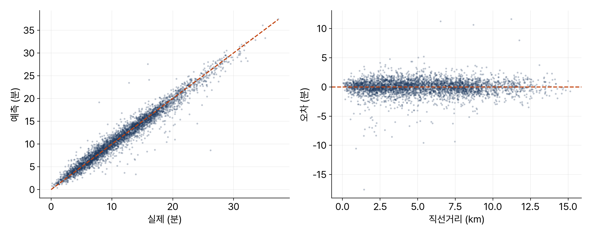

<!-- 덱 설계
청중: 가천대 스마트시티학과 학부 3학년. 중간시험을 마쳤고 머신러닝은 처음
시간: 100분 중 슬라이드 25분, 나머지 75분은 교재 9장을 화면에 표시하고 셀을 실행 → 본문 12장
메시지: 배차에 필요한 것은 정확한 경로가 아니라 순위이므로 예측으로 대체할 수 있다
목표: (1) 학습 데이터 구성과 특징 선택 (2) 기준선부터 단계적 개선 (3) MAE와 R²로 평가 (4) 속도와 정확도의 거래
출처: mobility-simulation-book/ko/ch09_eta.md · 제외: 코드 작성(교재에서), 우회율 대체 특징(연습 9.3)
구조: 섹션 = 교재 절. 9.2-9.3, 9.4-9.5, 9.7과 정리를 각각 한 섹션으로 통합했다
그림: figures/ch09_*.png 는 slides/tools/make_figures_week10.py 로 생성
빌드: ~/miniconda3/bin/python3 ~/.claude/skills/md2pptx/scripts/md2pptx.py slides/week10/ch09_eta.md
-->

# 도입과 학습 목표

## 계산하는 대신 예측하기

- 4장의 계산: 시뮬레이션 1회에 라우팅 질의 3만 회 이상, 소요 수 분
- 축약 계층은 직접 구현하지 않기로 결정
- 다른 방법: 정확한 답을 계산하는 대신 예측
- 근거: 좌표와 시각만 있으면 사람도 대략 추정 — 5 km면 15분 정도

> 교재 9장 도입부. 그 추정을 데이터로 학습시키는 것이 이 장의 내용이다.

## 학습 목표

- 라우팅 결과를 정답으로 삼는 학습 데이터 구성
- 직선거리 기준선부터 단계적 모델 개선
- 평균절대오차와 결정계수로 모델 평가
- 예측 속도와 정확도의 거래를 수치로 확인

> 교재 9장 학습 목표와 같다. 부교재 『핸즈온 머신러닝』이 이 장의 배경이다.

# 교재 9.1 학습 데이터와 특징

## 정답 생성과 데이터 분할

- 정답 생성 장치: 3장의 다익스트라
- 무작위 출발지와 목적지 쌍 2만 건의 실제 소요시간 계산
- 학습 80%, 검증 20%로 분할
- 검증 데이터를 분리하는 이유: 암기와 일반화를 구분

> 학습에 쓴 데이터로 평가하면 외운 것과 이해한 것을 구분할 수 없다. 데이터 생성은 약 3분이 걸려서 미리 만들어 저장해 두었다.

## 특징 여덟 개

표: 예측에 사용하는 특징과 선택 이유
| 특징 | 선택 이유 |
|---|---|
| straight_km | 거리가 가장 강한 신호 |
| hour | 시간대별 속도 차이 |
| sin_bearing · cos_bearing | 방향 — 한강 횡단과 강변 방향의 차이 |
| 출발·도착 위경도 네 개 | 시가지와 외곽의 도로 사정 차이 |

- 실제 도로 거리는 특징에서 제외 — 예측 시점에 알 수 없음
- 방위각을 두 값으로 분해하는 이유
  - 359도와 1도는 거의 같은 방향인데 숫자로는 358만큼 차이
  - 원 위의 각도를 좌표 두 개로 변환하면 해결

> 예측할 때 얻을 수 없는 값을 특징에 넣으면 안 된다. 이것이 이 절의 요점이고 기말 프로젝트에서도 반복된다.

# 교재 9.2–9.3 기준선과 선형회귀

## 기준선과 평가 지표

- 기준선: 직선거리를 평균 속도로 나눈 값
- 기준선 성능 MAE 2.52분 — 평균 통행 11.8분 대비 20% 초과 오차
- MAE(평균절대오차) — 평균 몇 분 틀리는지, 단위가 분이라 바로 해석
- R²(결정계수) — 정답 변동의 설명 비율, 0이면 평균값 응답과 동일

> 기준선을 먼저 정한다. 기준선보다 못하면 그 모델은 쓸모가 없다.

## 선형회귀의 한계

표: 모델별 성능 비교
| 모델 | MAE |
|---|---|
| 기준선 (직선거리 ÷ 평균속도) | 2.52분 |
| 선형회귀 (직선거리만) | 기준선보다 소폭 개선 |
| 선형회귀 (특징 8개) | 2.16분 |

- 단일 특징 모델이 나아진 이유: 절편이 출발·도착 소요시간을 반영
- 특징을 일곱 개 추가해도 거의 개선되지 않음
- 원인: 선형회귀는 각 특징이 일정 비율로 기여한다고 가정
- 실제로는 위치가 다른 특징과 얽혀 작동

> 위도가 0.01 올라갈 때 시간이 항상 같은 만큼 늘지 않는다. 시가지에서는 신호가 여럿이고 외곽에서는 도로가 뚫려 있다.

# 교재 9.4–9.5 부스팅과 특징 중요도

## 그래디언트 부스팅

- 의사결정나무는 조건이 얽힌 규칙을 표현
  - 예시: 위도 37.55 초과이고 직선거리 4 km 초과면 12분
- 나무 하나는 약하지만 앞 나무의 오차를 다음 나무가 보정
- 결과: MAE 0.89분, R² 0.954
- 선형회귀 2.16분 대비 절반 이하 — 평균 1분 이내 오차

> 얽힌 조건을 자연스럽게 표현하는 것이 나무 계열 모델의 장점이다. 이 부분은 다른 과목에서 더 자세히 다룬다.

## 중요도 상위는 좌표

- 중요도 상위: 출발·도착 좌표 네 개 — 직선거리보다 높음
- 이유: 좌표 네 개로 거리도 계산되고 지역별 도로 사정까지 학습
- 중요도 최하위는 시간대
- 시간대별 평균 소요시간은 11.0분에서 12.7분 — 차이 1.7분

> 4장에서 확인한 62% 차이는 특정 구간의 이야기다. 무작위 출발지와 목적지 쌍의 대부분은 이면도로를 쓰는 짧은 통행이고, 이면도로는 시간대별 속도 차이가 작다.

# 교재 9.6 속도와 정확도의 거래

## 3천 배 빠르고 1분 틀림

표: 용도별 예측 모델 적용 가능 여부
| 용도 | 판단 | 이유 |
|---|---|---|
| 배차 후보 선택 | 사용 가능 | 순위만 필요, 1분 오차로 역전 드묾 |
| 승객 안내 도착 예정시간 | 사용 곤란 | 실제 경로 계산 필요 |
| 차량 주행 경로 표시 | 사용 불가 | 좌표열이 필요 |

- 다익스트라 1건 7,400 마이크로초, 모델 예측은 약 3천 배 빠름
- 시뮬레이션 1회에 수 분이 걸리던 것이 수 초로 단축
- 시뮬레이터의 방식: 후보 선택은 예측, 확정 통행은 라우팅

> 이 모델을 만든 이유는 정확도가 아니라 속도다. 거래를 받아들일지는 용도에 달렸다.

# 교재 9.7 오차 분석과 정리

## 오차가 커지는 구간

- 예측값이 대각선을 따라 분포 — MAE 0.89분, R² 0.954
- 거리 구간별 평균절대오차는 0.85분에서 0.94분으로 큰 차이 없음
- 큰 오차가 나는 사례: 실제 도로 거리가 직선거리보다 훨씬 큰 통행

> 강 건너편이거나 산을 우회해야 하는 경우다. 좌표만 확인하는 모델이 이것을 알아내기 어렵다. 개선하려면 두 지점 사이의 장애물 여부를 알려 주는 특징이 필요하고, 연습 9.3에서 시도한다.

## 오늘의 정리

- 배차에 필요한 것은 정확한 경로가 아니라 순위 — 예측으로 대체 가능
- 특징은 예측 시점에 얻을 수 있는 것만 사용
- 기준선 2.52분, 선형회귀 2.16분, 부스팅 0.89분
- 다익스트라보다 3천 배 빠르고 평균 1분 오차

> 원 위의 값은 사인과 코사인 두 개로 분해해 넣는다는 점도 다시 언급한다. 오후에는 이 예측을 배차 비용행렬에 넣는다.

## 연습과 다음 장

- 연습 9.1 ★ — 나무 개수를 50에서 800까지 변경했을 때의 성능과 학습 시간
  - 산출물: 개수별 MAE와 학습시간 표, 적정 값과 근거 2줄
- 연습 9.2 ★★ — 특징을 하나씩 제거하는 실험
  - 산출물: 특징별 MAE 증가량 표, 중요도 순서와의 비교 3~4줄
- 연습 9.3 ★★★ — 우회 여부를 대신하는 특징 설계
- 다음 장: 10장 배차와 물류 최적화

> 연습 9.3에서는 특징 계산 비용도 함께 측정한다. 모델을 쓰는 이유가 속도였으므로 특징 계산이 라우팅만큼 비싸지면 의미가 없다.
