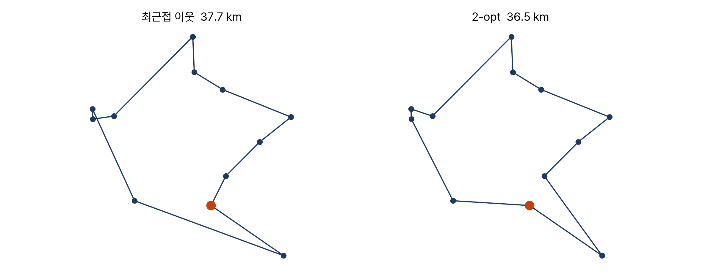

<!-- 덱 설계
청중: 가천대 스마트시티학과 학부 3학년. 오전에 ETA 예측 모델을 확인한 상태
시간: 100분 중 슬라이드 25분, 나머지 75분은 교재 10장을 화면에 표시하고 셀을 실행 → 본문 13장
메시지: 배차는 비용행렬 문제이고, 전체를 함께 푸는 쪽이 더 좋으면서 더 빠르다
목표: (1) 비용행렬 정식화 (2) 탐욕과 할당 문제 비교 (3) ETA 모델을 비용행렬에 적용 (4) 물류로의 확장
출처: mobility-simulation-book/ko/ch10_dispatch.md · 제외: 코드 작성(교재에서), 다목적 배차(연습 10.3)
구조: 섹션 = 교재 절. 10.1-10.3, 10.4-10.5를 각각 한 섹션으로 통합했다
그림: figures/ch10_*.png 는 slides/tools/make_figures_week10.py 로 생성
빌드: ~/miniconda3/bin/python3 ~/.claude/skills/md2pptx/scripts/md2pptx.py slides/week10/ch10_dispatch.md
-->

# 도입과 학습 목표

## 최근접 차량이 겹칠 때

- 상황: 승객 세 명이 거의 동시에 호출, 근처 빈 차 세 대
- 단순한 답: 각자 가장 가까운 차
- 문제: 세 사람의 최근접 차량이 같은 차량일 수 있음
- 선착순 배정 시 나머지 두 명은 먼 차량을 배정받음

> 교재 10장 도입부. 전체를 함께 보면 더 나은 조합이 있을 수 있다는 것이 이 장의 출발점이다.

## 학습 목표

- 배차를 비용행렬 문제로 정식화
- 탐욕 배차와 할당 문제 해법을 비교하고 차이 측정
- 9장의 ETA 모델을 비용행렬에 적용
- 같은 수학이 물류 배송 경로에도 적용된다는 점 확인

> 교재 10장 학습 목표와 같다. 부교재로 Google OR-Tools 문서를 함께 안내한다.

# 교재 10.1–10.3 비용행렬과 두 해법

## 비용행렬

- 행은 승객, 열은 차량, 칸은 그 차량이 그 승객에게 도달하는 시간
- 예시 상황: 승객 0과 승객 1의 최근접 차량이 모두 차량 0
- 배차 결정 = 행렬에서 행마다 열 하나를 고르되 열 중복 없이
- 목적함수: 선택한 칸의 합을 최소화

> 문제를 표로 적으면 명확해진다. 이 표 하나가 이 장 전체의 대상이다.

## 탐욕 배차

- 규칙: 호출 순서대로 남은 차량 중 최근접 차량 배정
- 승객 0이 차량 0을 배정받고, 승객 1은 차선을 배정받음
- 겉보기 공정성: 먼저 호출한 사람이 먼저 배정
- 한계: 전체 대기시간의 합에서는 더 나은 배치가 존재

> 공정해 보이는 규칙이 전체로는 손해라는 점을 학생들이 직접 계산해 보게 한다.

## 할당 문제

- 전수 탐색은 승객 3명이면 6가지로 가능
- 승객 20명이면 20 팩토리얼 — 약 243경 가지로 불가능
- 이 문제의 이름은 할당 문제, 헝가리안 알고리즘으로 다항 시간에 해결
- 구현은 scipy 제공 — 직접 작성하지 않음

> 3장과 6장은 직접 구현했지만 여기서는 라이브러리를 쓴다. 무엇을 직접 짜고 무엇을 가져다 쓸지의 기준을 다시 언급한다.

# 교재 10.4–10.5 차이와 속도

## 두 방법의 차이

표: 무작위 200회 비교 결과 (승객 8명, 차량 10대)
| 항목 | 값 |
|---|---|
| 평균 개선 | 14% |
| 최대 개선 | 79% |
| 차이 없던 경우 | 200회 중 일부 |

- 최적해가 탐욕보다 나쁠 수 없다는 것을 코드에 단언문으로 명시
- 어긋나면 구현 오류 — 나중에 수정하다 깨뜨렸을 때 즉시 발견
- 2장과 3장의 검증 습관이 여기서도 반복

> 이런 확인을 코드에 넣어 두면 회귀를 바로 잡을 수 있다.

## 최적해가 더 빠른 이유

- 문제 크기가 50을 넘으면 헝가리안이 탐욕보다 빠름
- 원인: 탐욕은 파이썬 이중 반복문, 헝가리안은 C 구현
- 3장에서 A*가 다익스트라보다 느렸던 것과 같은 구조의 현상
- 더 좋은 답을 더 빨리 내므로 헝가리안이 기본값

> 승객이 수만 명이면 헝가리안도 느려진다. 그럴 때는 각 승객마다 가까운 차량 20대만 남겨 행렬을 줄인다. 실제 엔진의 후보 제한 인자가 이것이다.

# 교재 10.6 비용 정의

## 세 가지 비용 산출 방법

표: 비용행렬을 채우는 세 가지 방법
| 방법 | 계산 비용 | 특징 |
|---|---|---|
| 직선거리 ÷ 25 km/h | 가장 저렴 | 강 건너 차량을 가깝다고 판단 |
| ETA 예측 모델 | 중간 | 9장에서 만든 모델 |
| 실제 라우팅 | 가장 비쌈 | 6×8 행렬 하나에도 시간 소요 |

- 판단 기준은 비용의 절댓값이 아니라 최종 차량 선택의 일치도
- 채점 방식: 각 방법의 결정을 실제 라우팅 비용으로 재계산

> 라우팅으로 정한 배차가 가장 나은 것은 채점 기준 자체가 라우팅 비용이라 당연하다.

## ETA 모델의 위치

- 관심사: ETA 모델 결정과 라우팅 결정의 근접도
- 라우팅의 3천분의 1 시간으로 거의 같은 결정을 내리면 사용 가치가 있음
- 직선거리는 저렴하지만 지형을 반영하지 못함
- 시뮬레이터의 방식: 후보 선택은 예측, 확정 통행은 라우팅

> 9장에서 확인한 속도와 정확도의 거래가 여기서 실제 결정으로 이어진다.

# 교재 10.7 물류로의 확장

## 같은 할당 문제의 사례

- 창고 3곳과 매장 5곳 사이의 배송량 배정
- 배송기사 10명과 배송 구역 10개의 배정
- 주문 100건과 배송차 20대의 배정
- 승객을 주문으로, 차량을 배송차로 바꾸면 같은 코드가 동작

> 이 과목 이름의 물류 부분이 여기서 나온다. 수학이 같다는 점을 강조한다.

## 방문 순서 문제

- 택시와 배송차의 차이: 배송차는 여러 곳을 차례로 방문
- 정해야 할 것이 짝짓기가 아니라 방문 순서 — 외판원 문제
- 최근접 이웃만으로도 경로 길이가 크게 감소
- 2-opt: 두 지점 사이를 역순으로 바꿔 짧아지면 채택, 반복

> 2-opt는 경로가 스스로 교차하는 부분을 해소하는 효과가 있다. 차량이 여러 대이고 적재 한계가 있으면 차량경로 문제가 되고, 실무에서는 전용 솔버를 쓴다. 원리는 같다.

# 교재 10.8 정리와 연습

## 시뮬레이션 안에서의 위치

- 지금까지 만든 것은 한 순간의 배차
- 시뮬레이션은 이것을 1분마다 반복
- 매 분의 절차
  - 도착한 호출을 대기 목록에 추가, 도착한 차량을 빈 차 목록으로 이동
  - 대기 승객과 빈 차가 모두 있으면 비용행렬 생성 후 배차
  - 배차된 차량을 승객 쪽으로 이동시키고 기록 저장
- 이 중 배차 단계가 오늘 만든 것

> 나머지 네 단계를 11주차에 만든다. 그것으로 시뮬레이터가 완성된다.

## 오늘의 정리

- 배차는 비용행렬 문제 — 행은 승객, 열은 차량, 칸은 도착 예상시간
- 할당 문제로 풀면 총 대기시간이 평균 14%, 최대 79% 감소
- 헝가리안은 C 구현이라 파이썬 탐욕보다 오히려 빠름
- 비용을 무엇으로 재느냐가 결정을 바꿈 — 직선거리는 지형을 반영하지 못함

> 같은 할당 문제가 물류 배정에 그대로 쓰이고, 여러 곳을 방문하는 문제는 외판원 문제와 차량경로 문제가 된다.

## 연습과 다음 장

- 연습 10.1 ★ — 탐욕 배차의 처리 순서를 바꿨을 때의 총 대기시간
  - 산출물: 세 가지 순서의 비교, 우열과 이유
- 연습 10.2 ★★ — 후보를 k대로 제한하는 가지치기 구현
  - 산출물: k별 총 대기시간, 계산 시간, 미배차 인원 표와 적정 k 근거 3줄
- 연습 10.3 ★★★ — 최대 대기 최소화와 10분 초과 인원 최소화
- 다음 장: 11장 시뮬레이션 루프 직접 구현

> 연습 10.3의 두 목적은 총합 최소화와 다른 결과를 낸다. 기말 프로젝트에서 어떤 목적을 택할지와 연결되는 문제다.
