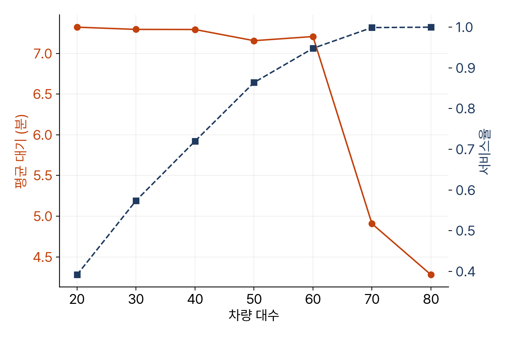

<!-- 덱 설계
청중: 가천대 스마트시티학과 학부 3학년. 도로망, 경로 탐색, 수요, 예측, 배차를 모두 확인한 상태
시간: 화 100분(스텝·상태·구현) + 수 100분(대조·조건 변경). 각 날 슬라이드 25분 → 본문 12장
메시지: 재료를 시간 축 위에서 결합하면 시뮬레이터가 완성되고, 그것이 1장의 질문에 답한다
목표: (1) 한 스텝의 다섯 단계 (2) 상태를 값 두 개로 표현 (3) 엔진 대조 (4) 대기시간의 두 부분
출처: mobility-simulation-book/ko/ch11_simloop.md · 제외: 코드 작성(교재에서), 차량 재배치(연습 11.3)
구조: 섹션 = 교재 절. 11.1-11.2, 11.3-11.4, 11.7-11.8을 각각 한 섹션으로 통합했다
그림: figures/ch11_*.png 는 slides/tools/make_figures_week11.py 로 생성
빌드: ~/miniconda3/bin/python3 ~/.claude/skills/md2pptx/scripts/md2pptx.py slides/week11/ch11_simloop.md
-->

# 도입과 학습 목표

## 재료가 다 모였습니다

- 도로망 2장, 최단경로 3~4장, 수요 8장, 소요시간 예측 9장, 배차 10장
- 이 장의 작업: 재료를 시간 축 위에서 결합
- 만드는 것: 0장에서 한 줄로 호출했던 시뮬레이션 루프
- 직접 구현 세 개 중 마지막 · 약 150줄

> 교재 11장 도입부. 이것이 끝나면 학기 초에 그린 시뮬레이터 그림의 상자가 전부 채워진다.

## 학습 목표

- 이산시간 시뮬레이션 한 스텝의 절차를 순서대로 기술
- 상태를 클래스가 아니라 값 두 개로 표현하는 방법 확인
- 직접 작성한 루프를 실제 엔진과 대조하고 차이 지점 발견
- 대기시간이 두 부분으로 구성된다는 점 확인

> 교재 11장 학습 목표와 같다. 세 번째와 네 번째가 기말 프로젝트 보고서에 직접 들어간다.

## 교재와 실습을 여는 곳

표: 오늘 여는 파일과 경로
| 자료 | 경로 |
|---|---|
| 교재 원고 | ko/ch11_simloop.md |
| 실습 노트북 | labs/ch11_simloop.ipynb |
| 채점 파일 | labs/ch11_simloop.py |

- 저장소: github.com/jihoyeo/mobility-simulation-book — blob/main 아래 경로
- 노트북 실행: jupyter lab labs/ch11_simloop.ipynb
- 진행 순서: 슬라이드 개요 → 교재 본문 → 실습 노트북
- 자가 채점: python labs/check.py ch11

> 슬라이드는 개요만 다룬다. 세부 내용과 코드는 교재 원고와 실습 노트북에서 확인한다. 교재 저장소는 비공개이므로 초대받은 계정으로 로그인한 상태여야 주소가 열린다.

# 교재 11.1–11.2 스텝과 상태

## 한 스텝의 다섯 단계

- 접수와 포기 처리
  - 1단계: 이번 분에 들어온 호출을 대기 목록에 추가
  - 2단계: 기준 시간을 초과해 기다린 호출을 포기 처리
- 3단계: 대기 승객과 빈 차가 모두 있으면 배차 — 10장에서 만든 부분
- 갱신과 기록
  - 4단계: 배차된 차량의 다음 가용 시각 계산
  - 5단계: 이번 분의 상태 기록

> 1분이라는 단위는 정한 값이다. 짧게 하면 정밀해지지만 느려지고, 길게 하면 반대다. 택시 배차에서 1분은 사람이 체감하는 단위와 비슷해 적당하다.

## 상태는 값 두 개면 충분

- 차량 상태를 대기, 픽업 이동, 승객 탑승의 세 가지로 열거하고 싶어지는 상황
- 실제로 필요한 것: 현재 위치와 다시 가용해지는 시각
- 가용 시각 하나로 운행 중과 대기 중이 모두 표현됨
- 상태 변수를 따로 두면 상태와 시각이 어긋나는 오류가 발생

> 실제 엔진은 이것을 객체가 아니라 표 여러 개로 관리한다. 승객 1만 명이면 파이썬 객체 1만 개보다 표 하나가 훨씬 빠르다. 읽기는 우리 방식이 쉽고 실행은 그쪽이 빠르다.

# 교재 11.3–11.4 루프와 실행

## 배차 이후의 처리

- 차량의 다음 가용 시각 = 하차 시각
- 차량 위치 = 승객의 목적지 — 내려준 자리에 정차
- 실제 택시 기사는 수요가 많은 곳으로 빈 차를 이동 — 재배치
- 이 책에서는 재배치를 다루지 않음, 연습 11.3에서 시도

> 기록에 남기는 컬럼 다섯 개는 실제 엔진의 기록 형식과 동일하게 맞췄다. 같은 형식이라야 대조할 수 있다.

## 실행 결과

- 하남 6시간 시뮬레이션 실행 시간 0.4초
- 4장에서 우려한 수 분이 아닌 이유: 소요시간을 직선거리로 근사
- 수요 데이터와 차량 데이터를 그대로 입력
- 결과로 요약 지표와 분 단위 기록을 반환

> 근사를 쓴 대가를 다음 절에서 엔진과 대조해 확인한다. 연습 11.2에서 9장 예측 모델로 교체해 본다.

# 교재 11.5 엔진 대조

## 지표와 시계열 비교

- 평균 대기시간 — 우리 루프 4.28분, 엔진 4.08분
- 차이 0.2분
- 운행 중 차량 시계열의 상관계수 0.9 이상
- 서로 다른 코드가 같은 답을 내는 것은 좋은 신호

> 같은 도시, 같은 수요, 같은 차량으로 실행한 결과다. 12장에서 이 대조를 지표 표로 정리한다.

## 상관계수를 쓸 수 없는 경우

- 대기 승객 시계열의 상관계수는 0에 근접
- 원인: 양쪽 모두 거의 항상 0이라 남은 잡음끼리의 상관
- 대안: 0인 비율과 평균으로 분포를 비교
- 원칙: 그 지표가 무엇을 측정할 수 있는 상태인지 먼저 확인

> 대기 승객이 거의 0인 시나리오에서 상관계수를 보고하면 숫자는 나오지만 뜻이 없다. 프로젝트 보고서에서 자주 나오는 실수다.

# 교재 11.6 대기시간의 두 부분

## 포기 기준 10분인데 최대 26분

- 대기시간의 구성
  - 호출부터 배차 확정까지
  - 배차 확정부터 차량 도착까지
- 포기 기준은 앞부분에만 적용
- 배차가 확정된 뒤에는 차량이 멀어도 대기
- 결과: 멀리 있는 차량이 배차되면 총 대기가 10분을 크게 초과

> 실제 엔진도 같은 구조다. 평균 대기 4분이라는 보고를 받으면 어느 대기인지 확인해야 한다. 이 구분이 12장 지표 해석의 기초가 된다.

# 교재 11.7–11.8 조건 변경과 정리

## 1장 질문에 대한 답

- 차량 80대에서 40대로 감축 시 가동률 상승, 서비스율 하락, 대기 증가
- 20대에서는 상당수가 배차 실패
- 선택 지점은 이 그림이 정해 주지 않음
- 시뮬레이터의 역할: 선택지마다 대가를 수치로 제시

> 1장에서 던진 차량을 절반으로 줄이면 어떻게 되는지가 이 표의 답이다. 승객의 대기시간과 운영자의 차량 비용 중 무엇을 얼마나 중시할지는 사람이 정한다.

## 배차 방법의 효과

- 10장 실험에서 헝가리안이 탐욕보다 14% 우수
- 전체 시뮬레이션에서는 차이가 1% 남짓
- 원인: 대부분의 분에 대기 승객이 0명에서 1명
- 결론: 배차 알고리즘은 수요가 공급을 압박할 때만 효과

> 차량을 25대로 줄이면 차이가 다시 드러난다. 어떤 개선이 언제 의미가 있는지 확인하는 사례다.

## 오늘의 정리

- 한 스텝은 다섯 단계 — 접수, 포기, 배차, 상태 갱신, 기록
- 차량 상태는 위치와 가용 시각 두 값이면 충분
- 우리 루프 4.28분, 엔진 4.08분, 운행 차량 시계열 상관 0.9 이상
- 대기시간은 배차까지와 차량 도착까지로 분리 — 포기 기준은 앞부분에만 적용

> 이것으로 시뮬레이터가 완성됐다. 학기 초 그림의 상자가 전부 채워졌다. 다음 주는 기말 프로젝트 발표다.

## 연습과 다음 주

- 연습 11.1 ★ — 포기 기준을 3, 5, 10, 20분으로 변경했을 때의 지표
  - 산출물: 기준별 지표 표, 적정 값과 근거 3줄
- 연습 11.2 ★★ — 소요시간 계산을 9장 예측 모델로 교체
  - 산출물: 두 방식의 비교표, 배치 예측의 속도 개선폭
- 연습 11.3 ★★★ — 차량 재배치 구현과 공차 거리의 대가 판단
- 다음 주: 12주차 기말 프로젝트 발표와 종강

> 연습 11.3은 12장에서 확인한 외곽 대기 문제에 대한 해법이다. 기말 프로젝트에서 노선 변경 시나리오를 맡은 팀원에게 권한다.
